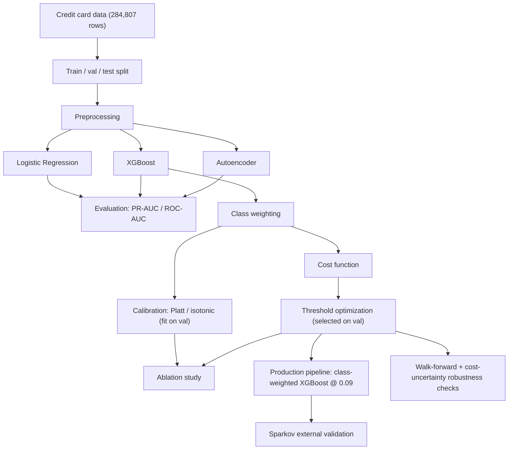
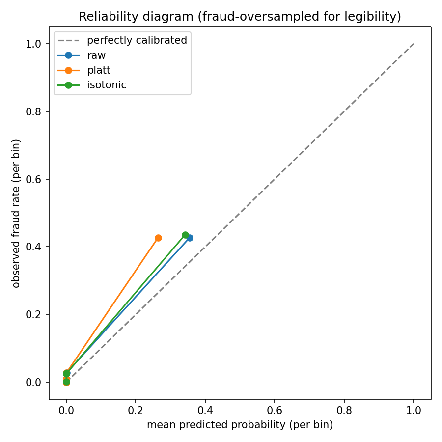
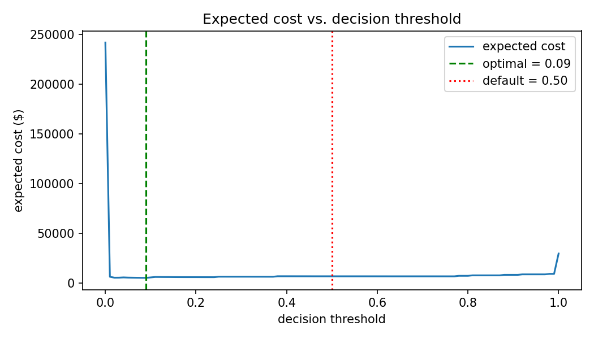
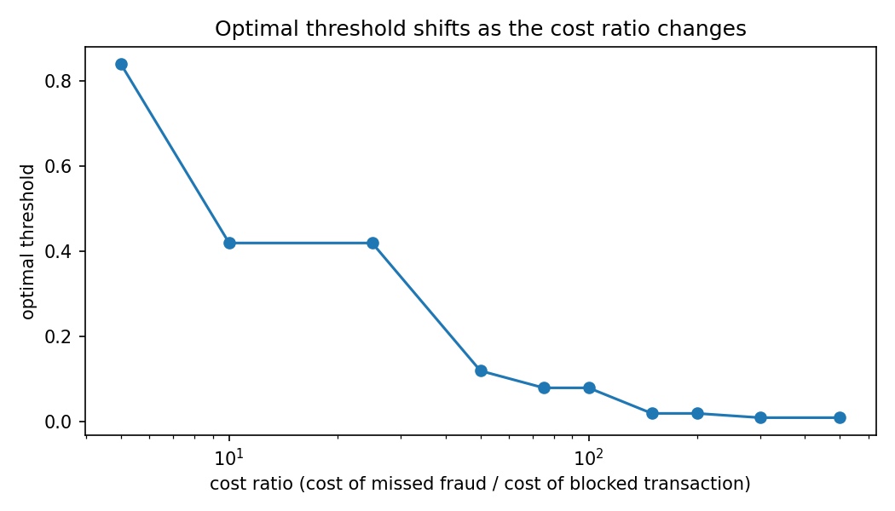
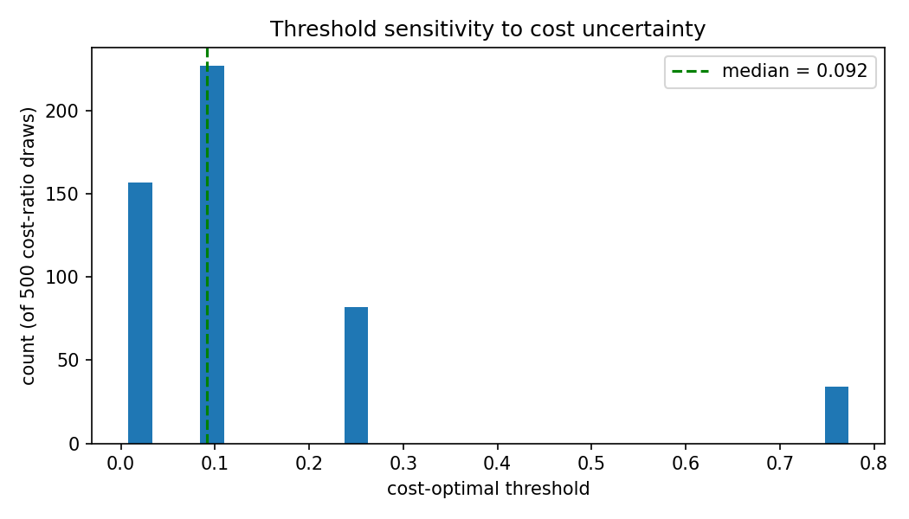
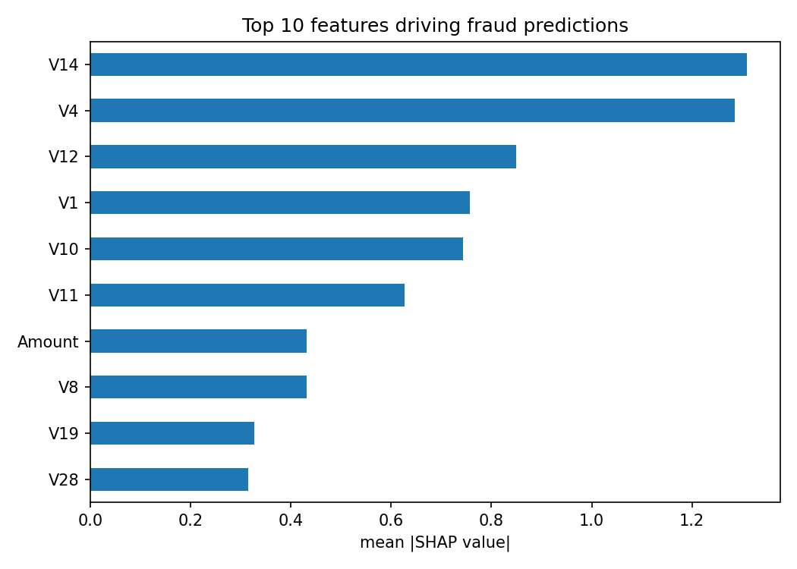
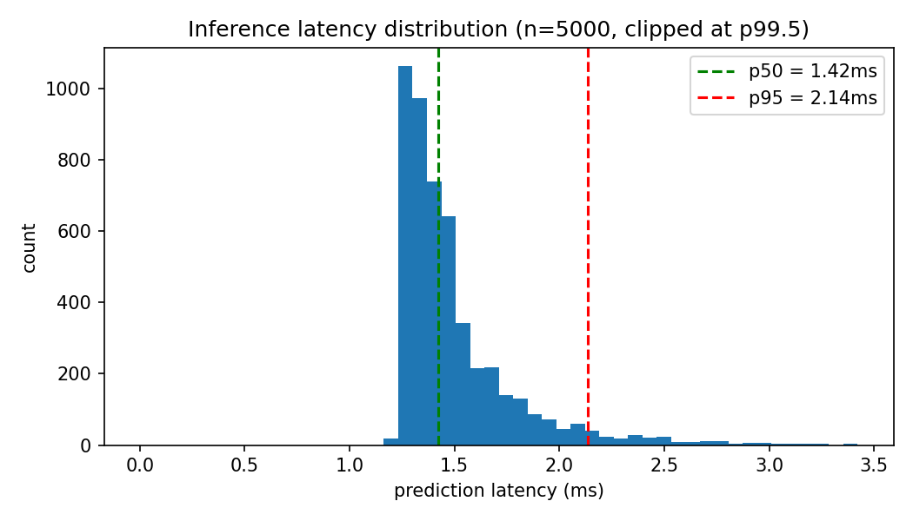
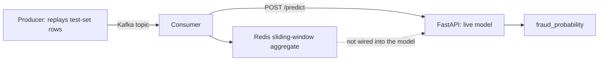

# Cost-Sensitive Fraud Detection with Threshold Optimization

[](https://github.com/Charith-Reddy-Pareddy/Cost-Sensitive-Fraud-Detection-with-Threshold-Optimization/actions/workflows/tests.yml)
[](LICENSE)

## Why this project?

Fraud detection is not an accuracy-maximization problem. Missing a fraudulent transaction and
blocking a legitimate customer have very different costs. This project studies how model choice,
class-imbalance strategy, and decision threshold affect that cost tradeoff — as a family of loss
functions swept across a wide range of cost ratios, not a single invented number — then asks the
sharper question: **how robust is that improvement**, once you check it against a held-out
validation split, across time windows, under cost-ratio uncertainty, and on a second, structurally
different dataset? Full writeup: **[`RESEARCH_REPORT.md`](RESEARCH_REPORT.md)**.

| | |
|---|---|
| Best model | XGBoost (class-weighted) |
| Cost-optimal threshold (selected on validation, at illustrative $500/$5 costs) | 0.09 |
| Cost reduction vs. default threshold (measured on untouched test) | 2.4% (95% bootstrap CI: −9.3% to 18.7%) |
| Optimized threshold beat default across 4 walk-forward time windows | 2 of 4 |
| Same conclusions replicate on a second dataset (Sparkov) | **No** — see [External validation](#external-validation-does-this-generalize-to-a-second-dataset) |
| Inference latency | 1.42ms p50 / 2.14ms p95 |

That table is more honest than it is flattering, on purpose — see
[`RESEARCH_REPORT.md`](RESEARCH_REPORT.md) for why, and
[Statistical stability](#statistical-stability) below for the numbers behind it.

A production-style prototype (not a production-ready system — see [Dataset](#dataset) for why)
that handles severe class imbalance and optimizes fraud decisions against real business cost.
Three modeling approaches are compared honestly (including failure modes), decision thresholds
are optimized against a financial loss function across a swept range of cost ratios, and the
selected model ships behind a working low-latency inference service rather than a notebook.

**Scope, honestly:** every technique used here — XGBoost, class weighting, SMOTE, autoencoders,
threshold optimization, calibration, SHAP, bootstrap CIs — is established, not novel. What this
project contributes is the combination, and specifically the robustness checks in
[`RESEARCH_REPORT.md`](RESEARCH_REPORT.md): most of them come back negative or null, which is
the actual point — a method that only looks good on one split is a weaker result than an honest
account of when it does and doesn't hold.

**Core research question:** how robust is cost-sensitive threshold optimization under temporal
distribution shift, cost-ratio uncertainty, and across datasets — not just whether it beats 0.5
on one test split?

See [`PLAN.md`](PLAN.md) for the original 7-day build plan this repo followed.

## Dataset

**Primary:** [Credit Card Fraud Detection](https://www.kaggle.com/mlg-ulb/creditcardfraud)
(Kaggle) — anonymized (PCA-transformed) European card transactions, single day, 284,807 rows,
492 fraud (0.17%). Split chronologically into **train (68%, 193,669 rows) / validation (17%,
48,417 rows) / test (15%, 42,721 rows)** — see [Methodology](#methodology) for why three splits,
not two.

**Secondary (external validation):** [Sparkov-simulated fraud
dataset](https://www.kaggle.com/datasets/kartik2112/fraud-detection) — 881,739 train rows, 4,989
fraud (0.57%), with real merchant/category/geolocation fields. Used in
[External validation](#external-validation-does-this-generalize-to-a-second-dataset) to check
whether the primary dataset's conclusions transfer to a structurally different dataset.

**Known limitations (stated upfront) — this is why "production-style prototype," not
"production system":**
- Single-day sample limits the ability to model concept drift over time — walk-forward
  evaluation ([Temporal stability](#temporal-stability-walk-forward-evaluation)) tests intra-day
  window stability, which is the most this single-day dataset can support.
- Heavy PCA anonymization (`V1`..`V28`) removes real-world feature semantics in the primary
  dataset.
- Risk of temporal leakage if train/validation/test splits aren't done chronologically —
  mitigated by splitting on `Time` rather than randomly (see
  [`src/data/ingest.py`](src/data/ingest.py)).
- The fraud/blocked-transaction dollar costs are **illustrative assumptions**, not sourced
  figures — [Cost uncertainty](#cost-uncertainty-is-the-threshold-robust-to-the-assumed-cost-ratio)
  treats them as a distribution rather than pretending they're known exactly.
- Only 492 fraud examples total in the primary dataset (52 in test); see
  [Statistical stability](#statistical-stability) for how much that limits precision on point
  estimates.

Detailed EDA (class balance, amount/time distributions, correlation structure) lives in
[`notebooks/01_eda.ipynb`](notebooks/01_eda.ipynb) rather than here, to keep this README focused
on architecture, cost curves, and latency.

## Methodology

**This is the most important section to read before trusting any number below.** Earlier
versions of this project selected the decision threshold using the test set's own labels —
`optimize_threshold(y_test, ...)` — then reported the resulting cost reduction on that same test
set. That makes the test set part of model selection, not a genuine held-out evaluation, and it's
why the originally-reported 13.3% cost reduction turned out to be inflated (the corrected number
is 2.4%). Every script in this repo now follows one protocol:

- The model is fit on **train** only.
- Every threshold, calibrator, or hyperparameter choice is selected on **validation** only.
- **Test** is touched exactly once per experiment, for final reporting, never for selection.

Full derivation and every experiment this unlocked: **[`RESEARCH_REPORT.md`](RESEARCH_REPORT.md)**.

## Architecture

**Offline experimentation pipeline** — everything that produces the numbers in this README:



**What's actually served** — the live inference path, separate from the analysis above:


Every training run logs params/metrics/artifacts to MLflow (project-local SQLite store,
`mlflow.db`, gitignored — run `mlflow ui --backend-store-uri sqlite:///mlflow.db` to browse).

## Modeling: three approaches, compared honestly

| Model | PR-AUC | ROC-AUC | F1 @ 0.5 |
|---|---|---|---|
| Logistic Regression | 0.647 | 0.966 | 0.581 |
| XGBoost (no imbalance handling) | 0.757 | 0.984 | 0.813 |
| **Autoencoder** (reconstruction error, unsupervised) | **0.273** | 0.947 | — |

The autoencoder is trained only on legitimate transactions and never sees a labeled fraud
example. Fraud rows get ~21x higher mean reconstruction error than legitimate ones (6.22 vs.
0.29), which is why ROC-AUC still looks reasonable (0.947) — but PR-AUC collapses to 0.273. That
gap is the finding: reconstruction error assumes fraud is statistically anomalous, which is only
partly true here — some fraud reconstructs about as well as an ordinary transaction, and some
unusual-but-legitimate transactions reconstruct as badly as fraud does. Full writeup:
[`docs/day3_autoencoder_and_imbalance_analysis.md`](docs/day3_autoencoder_and_imbalance_analysis.md)
(numbers there predate the val-split protocol; the table above is current).

## Handling class imbalance

Resampling is applied **inside** the training pipeline only (never before the train/test split)
to avoid leakage. SMOTE is treated as one experimental comparison point, not the default.

| Strategy (XGBoost) | PR-AUC | ROC-AUC | F1 @ 0.5 |
|---|---|---|---|
| None | 0.757 | 0.984 | **0.813** |
| Class weighting | 0.758 | 0.983 | 0.736 |
| SMOTE | **0.760** | 0.970 | 0.611 |

Under the corrected protocol this table reads differently than it used to, and more
interestingly: PR-AUC barely moves across all three (0.757 → 0.758 → 0.760, within noise), but
**F1 at the default threshold gets steadily worse** as more imbalance handling is applied
(0.813 → 0.736 → 0.611). Class weighting and SMOTE both shift probability mass in a way that
costs precision at threshold 0.5, even though they marginally improve ranking. This is itself an
argument for why threshold tuning has to be a separate step from imbalance handling, not a
side-effect of it — evaluating any of these three at a fixed 0.5 threshold alone would send you
in the wrong direction. Class weighting is still the strategy carried forward below, on the
strength of its (small) PR-AUC edge and because it doesn't invent synthetic transactions.

## Training-objective vs. decision-policy

Class weighting only encodes class *frequency* — it has no idea a missed fraud costs $500 and a
blocked transaction costs $5. [`src/models/cost_sensitive_training.py`](src/models/cost_sensitive_training.py)
weights each training row directly by its dollar cost instead, so the *training objective* is
asymmetric the same way the business cost is, not just the decision threshold applied afterward.
Four configurations, same train/val/test protocol
([`src/models/run_training_objective_comparison.py`](src/models/run_training_objective_comparison.py)):

| Configuration | Threshold | PR-AUC | Recall | Expected cost |
|---|---|---|---|---|
| A: standard training, threshold 0.5 | 0.50 | 0.757 | 0.712 | $7,510 |
| B: standard training, optimized threshold | 0.01 | 0.757 | 0.750 | $6,795 |
| **C: cost-weighted training, threshold 0.5** | **0.50** | **0.761** | **0.750** | **$6,530** |
| D: cost-weighted training, optimized threshold | 0.02 | 0.761 | 0.750 | $7,070 |

**C beats both B and D.** Cost-weighted training alone, at the plain default threshold, beats
either decision-time threshold tuning alone or the two combined — combining them (D) is *worse*
than cost-weighted training by itself, because threshold selection on top of an already
cost-shifted probability distribution is itself unstable. Training-time and decision-time
cost-sensitivity are not simply additive; here they partially substitute for each other. Full
discussion: [`RESEARCH_REPORT.md`](RESEARCH_REPORT.md#4-does-training-time-cost-sensitivity-add-anything-over-threshold-tuning).

## Probability calibration

Threshold optimization implicitly assumes the model's scores mean something as probabilities.
This checks that assumption directly: fit the class-weighted XGBoost model on train, fit Platt
scaling and isotonic regression on validation, select each method's cost-optimal threshold on
validation too, then compare Brier scores and cost on the untouched test set
([`src/models/run_calibration_analysis.py`](src/models/run_calibration_analysis.py)):



| Method | Brier score | Threshold (val) | Cost (test) |
|---|---|---|---|
| Raw | 0.00061 | 0.090 | $6,415 |
| Platt scaling | 0.00047 | 0.010 | $6,605 |
| **Isotonic regression** | **0.00043** | 0.010 | **$6,235** |

**Calibration does change the cost-optimal threshold** — and the result is more nuanced than
"calibration helps": isotonic regression gives the best-calibrated probabilities (lowest Brier
score) and the lowest cost among the calibrated options, but Platt scaling, despite also
improving calibration over the raw scores, actually *increases* expected cost relative to the
raw, uncalibrated model. Better calibration (lower Brier) does not automatically mean better
cost-optimized decisions — the two objectives are related but not the same thing.

## Cost-sensitive decision engine

The primary claim of this project isn't "$500 and $5 are the right costs" — it's that **sweeping
a family of asymmetric loss functions reveals how the optimal operating point moves**, which no
single fixed-cost scenario can show. The $500/$5 scenario below is one illustrative point on that
sweep, used consistently across sections for comparability. Every threshold below is selected on
the validation split; every dollar figure is reported on the untouched test split.

Illustrative costs: **$500** per missed fraud (false negative), **$5** per blocked legitimate
transaction (false positive) — assumptions for demonstrating the method, not sourced figures.



| | Threshold | Expected cost (test set) |
|---|---|---|
| Default | 0.50 | $6,575 |
| **Cost-optimized (selected on val)** | **0.09** | **$6,415** |

**2.4% reduction in expected financial loss** versus the default 0.5 threshold, on the
class-weighted XGBoost model (95% bootstrap CI: −9.3% to 18.7% — see
[Statistical stability](#statistical-stability)). This is the corrected, honest version of a
number that was originally reported as 13.3% before the train/val/test protocol fix — see
[Methodology](#methodology).

### What moving the threshold actually costs you

The core tradeoff, made concrete, all thresholds evaluated on test
([`src/models/run_threshold_comparison.py`](src/models/run_threshold_comparison.py)):

| Threshold | Precision | Recall | FP | FN | Expected cost |
|---|---|---|---|---|---|
| 0.02 | 0.146 | 0.808 | 246 | 10 | $6,230 |
| 0.05 | 0.244 | 0.788 | 127 | 11 | **$6,135** |
| **0.09 (cost-optimal, selected on val)** | **0.325** | **0.769** | **83** | **12** | $6,415 |
| 0.20 | 0.534 | 0.750 | 34 | 13 | $6,670 |
| 0.50 | 0.722 | 0.750 | 15 | 13 | $6,575 |

Notice threshold 0.05 actually achieves a *lower* test cost ($6,135) than the val-selected
"cost-optimal" 0.09 ($6,415). That's not an error — it's the val→test generalization gap made
visible, exactly what a genuine held-out test set is supposed to expose, and exactly what the old
test-set-selected protocol could never have shown (it would have picked whatever looked best on
test by construction).

### Cost-ratio sensitivity sweep

Sweeping the ratio of (cost of missed fraud) / (cost of a blocked transaction) — not just one
fixed value — shows how the optimal threshold moves as that ratio changes, with the precision/
recall/false-positive-rate tradeoff it implies at each point. Thresholds selected on val,
metrics reported on test
([`src/models/run_threshold_comparison.py`](src/models/run_threshold_comparison.py)):



| Cost ratio | Optimal threshold | Precision | Recall | FPR |
|---|---|---|---|---|
| 1 | 0.87 | 0.822 | 0.712 | 0.0002 |
| 5–10 | 0.75 | 0.809 | 0.731 | 0.0002 |
| 25 | 0.24 | 0.591 | 0.750 | 0.0006 |
| 50–100 | 0.09 | 0.325 | 0.769 | 0.0019 |
| 250 | 0.02 | 0.146 | 0.808 | 0.0058 |
| 500 | 0.01 | 0.083 | 0.808 | 0.0109 |

As missing fraud becomes relatively more expensive, the optimizer accepts more false positives to
catch more fraud — recall climbs from 0.712 to 0.808 while precision falls from 0.822 to 0.083
across the swept range. That's the actual contribution of this section: not a threshold, but a
map of how the threshold should move as business priorities shift.

## Temporal stability: walk-forward evaluation

A single train/val/test split answers "did this work on this one window." The dataset (sorted
by time) is cut into 5 equal blocks; fold *k* trains on an expanding window (blocks 0..k-1),
selects the threshold on the first half of block *k*, and reports on the second half — so
training data only ever grows forward in time
([`src/models/run_temporal_evaluation.py`](src/models/run_temporal_evaluation.py)):

| Fold | Train rows | Threshold (val) | Default cost (test) | Optimized cost (test) | Result |
|---|---|---|---|---|---|
| 1 | 56,961 | 0.04 | $4,520 | $4,340 | beats |
| 2 | 113,922 | 0.62 | $5,180 | $5,665 | worse |
| 3 | 170,884 | 0.56 | $4,015 | $4,015 | tie |
| 4 | 227,845 | 0.05 | $3,060 | $3,840 | worse |

**The optimized threshold beat the default in only 2 of 4 folds**, and the selected threshold
swings from 0.04 to 0.62 across windows. This dataset covers a single day, so it can't test
genuine multi-day concept drift — but it does show the headline 2.4% result is not stable even
across different windows of the same day. A single-split result looked like a clean win; four
splits show something closer to a coin flip.

## Cost uncertainty: is the threshold robust to the assumed cost ratio?

Every section above treats $500/$5 as fixed and known. Here, `cost_fn ~ Uniform(100, 1000)` and
`cost_fp ~ Uniform(1, 20)` are drawn independently 500 times; for each draw the cost-optimal
threshold is selected on validation
([`src/models/run_cost_uncertainty_analysis.py`](src/models/run_cost_uncertainty_analysis.py)):



| Statistic | Value |
|---|---|
| Median | 0.090 |
| Mean / std. dev. | 0.151 / 0.178 |
| IQR | [0.090, 0.240] |
| Range | [0.010, 0.750] |

The median matches the point-estimate result from the $500/$5 scenario, which is reassuring — but
the range (0.01 to 0.75) means a materially different, still-plausible cost assumption would pick
a very different operating point. The distribution is multi-modal (clustered at a few plateaus
rather than smooth), itself a consequence of how few fraud examples (59) sit in the validation
split.

## Statistical stability

Fraud is 0.17% of this dataset — a single chronological test split (52 fraud rows out of 42,721)
is not a lot of positive examples to draw firm conclusions from. Bootstrap resampling (1,000
resamples, 95% CI) on the production model's real test-set predictions quantifies that directly
([`src/models/run_bootstrap_analysis.py`](src/models/run_bootstrap_analysis.py)):

| Metric | Point estimate | 95% CI |
|---|---|---|
| PR-AUC | 0.758 | [0.630, 0.860] |
| Precision @ 0.09 | 0.325 | [0.235, 0.407] |
| Recall @ 0.09 | 0.769 | [0.640, 0.871] |
| Expected cost @ 0.09 | $6,415 | [$3,390, $9,935] |
| Cost reduction vs. default | 2.4% | [−9.3%, 18.7%] |

That last row is the important one to sit with: the point estimate says the optimized threshold
beats the default, but the interval crosses zero — on an unlucky resample, the "optimized"
threshold could come out worse than 0.5. Combined with the walk-forward result (2 of 4 folds) and
the cost-uncertainty spread, the honest summary is that cost-sensitive threshold optimization has
a positive expected effect here but is not a reliably-winning intervention on a 492-fraud-row
dataset — a concrete argument for why this reads as a *prototype* result, not a
production-validated one.

## Model interpretability

SHAP (`TreeExplainer`) over the class-weighted XGBoost model, sampled 2,000 test rows (all fraud
rows plus a matched legitimate sample, since fraud is too rare to show up reliably in a plain
random sample):



`V4`, `V14`, and `V12` are the strongest drivers, consistent with published analyses of this
dataset that repeatedly identify `V14`/`V12`/`V10`/`V17` as the components carrying the most
fraud signal — despite `V1`..`V28` having no semantic meaning on their own (PCA components, not
named business features).

## Ablation study

What does each design decision actually contribute, in isolation, under the full train/val/test
protocol ([`src/models/run_ablation_study.py`](src/models/run_ablation_study.py))?

| Configuration | PR-AUC | Expected cost |
|---|---|---|
| No weighting + threshold 0.5 | 0.757 | $7,510 |
| Class weighting + threshold 0.5 | 0.758 | $6,575 |
| Class weighting + optimized threshold (0.09) | 0.758 | $6,415 |
| Class weighting + isotonic calibration + optimized threshold (0.01) | 0.749 | **$6,235** |

The most counter-intuitive line is the first two: class weighting barely moves PR-AUC (0.757 →
0.758, within noise) but cuts expected cost by nearly $1,000 — because PR-AUC is a
threshold-independent ranking metric, while cost depends on *where* the probability mass sits
relative to a fixed decision boundary. Two models can rank transactions almost identically and
still produce very different real-world costs. This is the concrete case for why PR-AUC alone was
never going to be enough to select a deployment threshold.

## External validation: does this generalize to a second dataset?

The primary dataset has only 492 fraud rows and anonymized PCA features — useful for
demonstrating the method, but not enough on its own to claim the conclusions generalize. The
[Sparkov-simulated fraud dataset](https://www.kaggle.com/datasets/kartik2112/fraud-detection)
(881,739 train rows, 4,989 fraud) has real merchant, category, and geolocation fields, enabling
genuine feature engineering instead of working only with anonymized components — haversine
distance between customer and merchant, transaction hour, customer age
([`src/data/ingest_sparkov.py`](src/data/ingest_sparkov.py)). Same protocol, same $500/$5 costs
([`src/models/run_sparkov_validation.py`](src/models/run_sparkov_validation.py)):

| | Primary dataset | Sparkov |
|---|---|---|
| Baseline PR-AUC (no weighting) | 0.757 | **0.909** |
| Class weighting vs. baseline | helps (marginally) | **hurts** (0.909 → 0.882 PR-AUC) |
| Threshold optimization vs. default | helps (2.4% cost reduction) | **no effect** (val selects 0.50) |

**Neither conclusion from the primary dataset replicates on Sparkov.** The likely reason:
Sparkov's engineered features separate fraud from legitimate transactions far better than
anonymized PCA components do (PR-AUC 0.909 / ROC-AUC 0.998 with no imbalance handling at all) —
when a model already separates classes almost perfectly, there's much less room for either
class-weighting or threshold-tuning to help, and rebalancing can actively distort an already
well-calibrated ranking. This isn't a failure of the method; it's evidence that its value is
dataset-dependent, concentrated in regimes where the raw signal is weak — a finding this project
would not have produced without a second dataset.

### Adding a real per-entity feature, and re-checking robustness on Sparkov

Sparkov has a card identifier (`cc_num`) the primary dataset doesn't — enough to build a genuine
per-entity feature: `card_txn_count_24h` / `card_amt_sum_24h`, a rolling count and amount sum of
that same card's transactions in the preceding 24 hours, computed causally so a transaction can
never see itself ([`src/data/ingest_sparkov.py`](src/data/ingest_sparkov.py)). Adding it and
repeating the [walk-forward](#temporal-stability-walk-forward-evaluation) and
[bootstrap](#statistical-stability) checks — this time on Sparkov:

| | Sparkov, no velocity feature | Sparkov, + card velocity feature |
|---|---|---|
| Baseline PR-AUC (no weighting) | 0.909 | **0.969** |
| Threshold optimization vs. default (single split) | 0% reduction | **−1.8%** (actively worse) |
| Cost-reduction 95% bootstrap CI | [0.0%, 0.0%] | [−9.1%, 1.5%] |
| Walk-forward: optimized beats default | 2 of 4 folds | **1 of 4 folds** |

The velocity feature is a genuinely strong signal — PR-AUC climbs from 0.909 to 0.969 — and it
makes the "threshold optimization doesn't help here" finding *more* decisive, not less: a
near-perfect model has even less room for threshold-tuning to help and more room to overfit
validation-split noise. The Sparkov comparison no longer rests on a single split.

### Closing the streaming gap

The [streaming section below](#streaming-prototype-primary-dataset) is explicit that the primary
dataset's Redis feature is never fed into the model — no entity ID to key it on. Sparkov's
`cc_num` removes that obstacle:
[`src/streaming/run_sparkov_streaming_demo.py`](src/streaming/run_sparkov_streaming_demo.py)
replays 5,000 real transactions through a **per-card** Redis sliding window
([`src/streaming/redis_features_sparkov.py`](src/streaming/redis_features_sparkov.py)) and feeds
the *live* velocity numbers directly into `pipeline.predict_proba(...)` for each one — not the
offline pre-computed version. Verified output, one card mid-fraud-burst:

```
cc_num=3573030041201292 amt=$8.28    live_card_txn_count_24h=4  fraud_probability=0.9999
cc_num=3573030041201292 amt=$353.57  live_card_txn_count_24h=5  fraud_probability=0.9998
cc_num=3573030041201292 amt=$876.10  live_card_txn_count_24h=6  fraud_probability=0.9997
```

47 fraud transactions in the replay, 87 flagged, 99.2% accuracy — but the number that matters is
`live_card_txn_count_24h` climbing transaction-by-transaction as Redis accumulates real state,
with the model's prediction responding to that same live number. That's the streaming feature
actually feeding the model, demonstrated rather than just claimed. Full discussion:
[`RESEARCH_REPORT.md`](RESEARCH_REPORT.md#5-does-any-of-this-generalize-to-a-structurally-different-dataset).

## Inference service

A FastAPI service (`src/serving/app.py`) loads the persisted production pipeline — the
class-weighted XGBoost model at its cost-optimized threshold (0.09, selected on validation) — and
exposes:

| Endpoint | Description |
|---|---|
| `GET /health` | liveness + current decision threshold |
| `POST /predict` | score a single transaction |
| `POST /replay?n=&delay_ms=` | replay `n` real test-set rows with a small delay, scoring each |
| `GET /latency` | p50/p95 over every prediction served so far |
| `GET /docs` | interactive Swagger UI (auto-generated by FastAPI) |

Latency, measured from 5,000 real served predictions (replay + individual calls):



**p50: 1.42ms, p95: 2.14ms** — comfortably low-latency for a synchronous scoring call.

### Live demo

```bash
uvicorn src.serving.app:app --reload
```

Then open `http://localhost:8000/docs` for the interactive Swagger UI, or call it directly:

```bash
curl -X POST localhost:8000/predict -H "Content-Type: application/json" -d '{
  "Time": 120000, "V1": -2.31, "V2": 1.95, "V3": -3.62, "V4": 3.11, "V5": -1.84,
  "V6": -0.55, "V7": -2.77, "V8": 0.66, "V9": -1.88, "V10": -3.99, "V11": 2.90,
  "V12": -4.30, "V13": 0.24, "V14": -5.10, "V15": 0.51, "V16": -1.63, "V17": -1.83,
  "V18": -0.11, "V19": 0.34, "V20": 0.20, "V21": 0.11, "V22": 0.20, "V23": -0.08,
  "V24": -0.11, "V25": 0.25, "V26": 0.10, "V27": 0.10, "V28": 0.04, "Amount": 99.99
}'
```

```json
{
  "fraud_probability": 0.913,
  "is_fraud": true,
  "threshold": 0.09,
  "latency_ms": 1.6
}
```

```bash
curl -X POST "localhost:8000/replay?n=500&delay_ms=1"
curl localhost:8000/latency
```

## Streaming prototype (primary dataset)

`docker-compose.yml` also brings up a streaming demo for the primary dataset — deliberately kept
separate from the inference path above, both architecturally and in this README. (Sparkov gets a
different, model-connected version of this — see
[Closing the streaming gap](#closing-the-streaming-gap) above.)



A producer replays test-set transactions onto a Redpanda (Kafka-API-compatible) topic with a
small delay; a consumer reads that stream, maintains a Redis-backed sliding-window feature
(rolling transaction count and amount sum over the last 30 seconds — global rather than per-card,
since this dataset has no card/merchant ID to key on), scores each transaction against the live
FastAPI service, and logs the result. Verified end-to-end via `docker compose up`:

```
amount=$892.16 fraud_probability=0.1286 is_fraud=True window[30s]: count=148 sum=$24602.63
```

**This is a genuine, working streaming feature-store mechanism — and it is explicitly not an
input the trained model uses.** The dashed line in the diagram above is not a simplification;
it's the actual current state. Wiring the sliding-window aggregate into the model would mean
retraining on a feature that doesn't exist in the static offline dataset used here. Sparkov's
`cc_num` field would finally make a genuine per-entity version of that feature possible, unlike
the primary dataset — see [`RESEARCH_REPORT.md`](RESEARCH_REPORT.md#future-work).

```bash
docker compose up --build
```

## Repository structure

```
├── PLAN.md                          original 7-day build plan
├── RESEARCH_REPORT.md               methodology fix + 5 robustness experiments
├── docs/                            per-day analysis writeups
├── data/
│   ├── raw/                         gitignored — populated via kaggle CLI, see below
│   └── processed/                   gitignored — populated via src/data/ingest*.py
├── notebooks/                       appendix EDA notebook
├── reports/figures/                 generated plots referenced above
├── src/
│   ├── data/                        ingestion + chronological split (primary and Sparkov)
│   ├── features/                    shared preprocessing pipeline
│   ├── models/                      training pipelines, cost engine, calibration,
│   │                                 bootstrap CIs, SHAP, ablation, temporal/cost-uncertainty/
│   │                                 training-objective/Sparkov robustness checks
│   ├── serving/                     FastAPI inference service
│   └── streaming/                   Kafka/Redpanda → Redis; per-card version model-connected
│                                     for Sparkov, global version not for the primary dataset
├── tests/                           pytest suite
├── .github/workflows/               CI (runs the test suite on every push)
├── docker-compose.yml
└── requirements.txt
```

## Reproducing this locally

```bash
python3 -m venv .venv && source .venv/bin/activate
pip install -r requirements.txt

kaggle datasets download -d mlg-ulb/creditcardfraud -p data/raw
unzip data/raw/creditcardfraud.zip -d data/raw && rm data/raw/creditcardfraud.zip

python -m src.data.ingest
python -m src.models.train_baseline
python -m src.models.train_autoencoder
python -m src.models.imbalance_comparison
python -m src.models.run_training_objective_comparison
python -m src.models.run_cost_analysis
python -m src.models.run_shap_analysis
python -m src.models.train_production_model
python -m src.models.run_calibration_analysis
python -m src.models.run_bootstrap_analysis
python -m src.models.run_threshold_comparison
python -m src.models.run_ablation_study
python -m src.models.run_temporal_evaluation
python -m src.models.run_cost_uncertainty_analysis

# optional external-validation dataset (~200MB download)
kaggle datasets download -d kartik2112/fraud-detection -p data/raw/sparkov
unzip data/raw/sparkov/fraud-detection.zip -d data/raw/sparkov
python -m src.data.ingest_sparkov
python -m src.models.run_sparkov_validation

pytest tests/ -q
```

**Environment note:** XGBoost and PyTorch each bundle their own OpenMP runtime; running both in
one process crashes on macOS unless `OMP_NUM_THREADS=1` is set (already handled in
[`src/__init__.py`](src/__init__.py)). `xgboost` is pinned below 3.0 because SHAP 0.49.1's
`TreeExplainer` can't yet parse XGBoost 3.x's `base_score` serialization format.

## What I'd do with more data

- Multi-day/multi-month data to actually study concept drift, instead of intra-day window
  stability.
- A standing, served Sparkov production pipeline the way the primary dataset has one in
  `src/serving/` — the live Redis-to-model connection is proven end-to-end
  ([Closing the streaming gap](#closing-the-streaming-gap)), but only as a replay demo script,
  not a persistent service.
- More fraud examples in the primary dataset — with only 492 positive rows, the bootstrap CIs
  above are wide enough that a production deployment would need materially more labeled fraud
  before trusting a single point estimate.

Full future-work list: [`RESEARCH_REPORT.md`](RESEARCH_REPORT.md#future-work). This section is
meant to signal awareness of this project's ceiling, not to pretend it's bigger than it is.

## License

[MIT](LICENSE)
