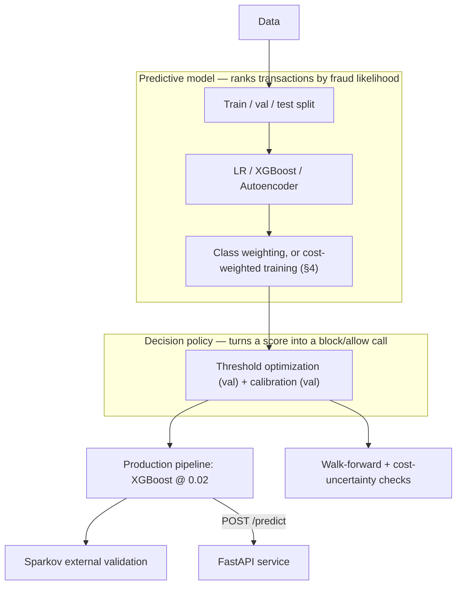
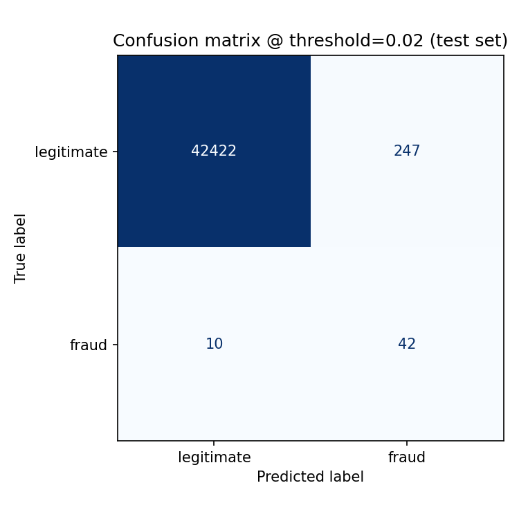
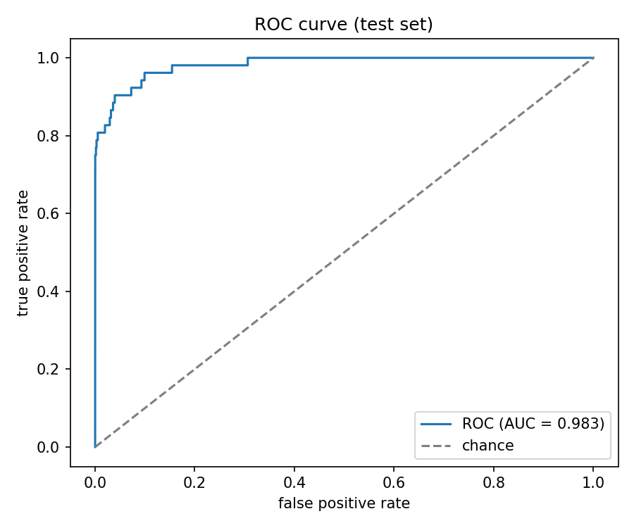
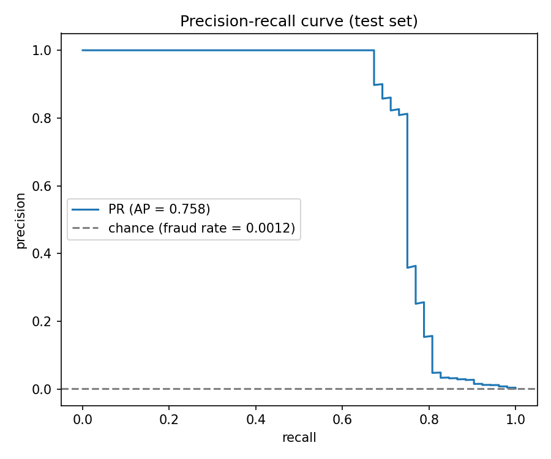
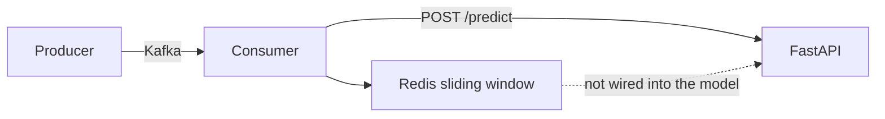

# Cost-Sensitive Fraud Detection with Threshold Optimization

[](https://github.com/Charith-Reddy-Pareddy/Cost-Sensitive-Fraud-Detection-with-Threshold-Optimization/actions/workflows/tests.yml)
[](LICENSE)

**[Live dashboard →](https://charith-reddy-pareddy.github.io/Cost-Sensitive-Fraud-Detection-with-Threshold-Optimization/)**
— headline metrics, confusion matrix, ROC/PR curves, and every robustness finding in one page.

**The problem.** Fraud detection is usually framed as an accuracy-maximization problem, but the
decision it actually feeds isn't: missing a fraudulent transaction and blocking a legitimate
customer cost different amounts, and a model can rank fraud excellently (high PR-AUC) while still
making bad decisions at whatever threshold it's deployed at. This project separates fraud
detection into two layers on purpose — a **predictive model** that ranks transactions by fraud
likelihood, and a **decision policy** on top of it that turns that ranking into a block/allow call
under an explicit cost function — and treats *when cost-sensitivity belongs in the training
objective versus the decision policy* as the central question, not an afterthought.

**The system.** Class-weighted XGBoost (plus an autoencoder and imbalance-handling comparison)
against $500/$5 illustrative costs, with exact and Bayes-optimal threshold search, probability
calibration, cost-weighted training as an alternative to threshold tuning, bootstrap/walk-forward/
cost-ratio robustness checks, amount-proportional costs and capacity-constrained review, SHAP
interpretability, external validation on a structurally different second dataset (Sparkov), a
FastAPI serving layer, a Redis/Kafka streaming prototype, and a live dashboard.

**Strongest result.** Cost-weighted training alone beats every threshold-tuned configuration
tested, including itself tuned further — and *why* is now a resolved, evidence-backed question,
not a guess: its raw Brier score is measurably worse than standard training's (0.00045 vs.
0.00040), and combining it with decision-time threshold tuning reliably makes things worse across
1,000 paired bootstrap resamples (P(worse) = 1.000). Cost asymmetry baked into training and
cost asymmetry applied at decision time aren't complementary here — they substitute for, and can
actively undermine, each other.

**Honest limitation.** The headline "does threshold optimization help" result doesn't reliably
replicate: it's a coin flip across time windows on the primary dataset (1 improved, 1 tied, 2
worsened of 4 walk-forward folds), its 95% bootstrap CI crosses zero, and it doesn't replicate at
all on a second, structurally different dataset. This project reports that plainly rather than
picking the split that looks best.

**Technologies:** Python, XGBoost, scikit-learn, imbalanced-learn, PyTorch, SHAP, MLflow, FastAPI,
Redis, Kafka (Redpanda), Docker/docker-compose, GitHub Actions, GitHub Pages.

**Core research question:** which modeling approach performs best under severe class imbalance,
and how does optimizing the decision threshold against a cost function change the tradeoff
between fraud detection and false positives — including how robust that optimum is under
temporal shift, cost-ratio uncertainty, and across datasets, not just whether it beats 0.5 on
one test split?

**Full writeup with every experiment: [`RESEARCH_REPORT.md`](RESEARCH_REPORT.md).** This README
is the short version.

| | |
|---|---|
| Best model | XGBoost (class-weighted) |
| Cost-optimal threshold (val-selected, exact search, $500/$5 illustrative costs) | 0.02 |
| Cost reduction vs. default (untouched test) | 5.2% (95% CI: −24.6% to 29.1%) |
| Walk-forward result (4 windows) | 1 improved, 1 tied, 2 worsened |
| Replicates on a second dataset (Sparkov) | **No** |
| Inference latency | 1.42ms p50 / 2.14ms p95 |

That table is honest rather than flattering on purpose. Every technique here — XGBoost, class
weighting, SMOTE, autoencoders, threshold optimization, calibration, SHAP, bootstrap CIs — is
established, not novel; the contribution is the robustness checks, and most of them come back
negative or null. See [`PLAN.md`](PLAN.md) for the original 7-day build plan.

## Dataset

**Primary:** [Credit Card Fraud Detection](https://www.kaggle.com/mlg-ulb/creditcardfraud)
(Kaggle) — anonymized PCA-transformed transactions, 284,807 rows, 492 fraud (0.17%). Split
chronologically: train 68% / val 17% / test 15%.

**Secondary (external validation):** [Sparkov](https://www.kaggle.com/datasets/kartik2112/fraud-detection)
— 881,739 rows, 4,989 fraud, with real merchant/category/geolocation fields.

**Limitations, stated upfront:** single day (no genuine multi-day drift — walk-forward only
tests intra-day windows); heavy PCA anonymization on the primary dataset; only 492 fraud rows
total (52 in test), so every interval below is wide; the $500/$5 costs are illustrative, not
sourced (see the cost-uncertainty sweep). Detailed EDA lives in
[`notebooks/01_eda.ipynb`](notebooks/01_eda.ipynb).

## Methodology

Earlier versions of this project selected the threshold using the test set's own labels, which
is how an inflated 13.3% cost reduction became the corrected 2.4%. Every script now follows one
rule: fit on **train**, select every threshold/calibrator on **validation**, touch **test**
exactly once, for final reporting. Full derivation: [`RESEARCH_REPORT.md`](RESEARCH_REPORT.md).

## Architecture



Two boxes, not one: a **predictive model** (top) that estimates fraud likelihood, and a
**decision policy** (bottom) that turns that estimate into a decision under an explicit cost
function. Cost-sensitivity can enter either layer — training-time (cost-weighted sample weights)
or decision-time (threshold tuning) — and Experiments 4/4b/4c in
[`RESEARCH_REPORT.md`](RESEARCH_REPORT.md) are about exactly that boundary: which layer should
carry the cost asymmetry, and what happens when both do.

Every training run logs to MLflow (`mlflow ui --backend-store-uri sqlite:///mlflow.db`).

## Results

| Model | PR-AUC | ROC-AUC | F1 @ 0.5 |
|---|---|---|---|
| Logistic Regression | 0.647 | 0.966 | 0.581 |
| XGBoost (no weighting) | 0.757 | 0.984 | 0.813 |
| Autoencoder (unsupervised) | 0.273 | 0.947 | — |

Autoencoder trained on legitimate transactions only; fraud gets ~21x higher reconstruction error
but PR-AUC still collapses, because reconstruction-anomalous and fraudulent only partly overlap.

| Imbalance strategy | PR-AUC | F1 @ 0.5 | Cost-weighted training | Calibration |
|---|---|---|---|---|
| None | 0.757 | **0.813** | standard @ 0.5: **$7,510** | raw: $6,415 |
| Class weighting | 0.758 | 0.736 | cost-weighted @ 0.5: **$6,530** | Platt: $6,605 |
| SMOTE | **0.760** | 0.611 | cost-weighted + tuned: $7,070 | **isotonic: $6,235** |

PR-AUC barely moves across imbalance strategies (within noise) while F1@0.5 gets steadily worse
— ranking and default-threshold precision aren't the same thing. Cost-weighted training beats
both threshold-tuning alone *and* the two combined (training-time and decision-time
cost-sensitivity partially substitute for each other, not add). Isotonic calibration wins on
both Brier score and cost; Platt scaling improves Brier but still costs more. Full discussion:
[`RESEARCH_REPORT.md`](RESEARCH_REPORT.md#experiments).

### How the production model detects fraud

The production pipeline (class-weighted XGBoost @ threshold 0.02) on the real, untouched test
set (42,721 rows, 52 fraud) — accuracy alone is meaningless at this imbalance (99.8% accuracy is
achievable by predicting "not fraud" every time), so this is confusion matrix, ROC, and
precision-recall, not a single accuracy number
([`src/models/run_evaluation_plots.py`](src/models/run_evaluation_plots.py)):





**42 of 52 fraud cases caught (recall 0.81), 247 false alarms out of 42,669 legitimate
transactions (precision 0.15), ROC-AUC 0.983, PR-AUC 0.758.** The production threshold moved from
0.09 to 0.02 when the model was retrained with exact threshold search instead of the 101-point
grid (see [Cost-sensitive threshold optimization](#cost-sensitive-threshold-optimization) below)
— 2 more fraud cases caught, 164 more false alarms, a real precision/recall tradeoff, not a free
improvement. The PR curve's chance line
(fraud rate 0.0012) is the point of showing it at all: ROC-AUC looks uniformly excellent even
for a mediocre model here, because true negatives are so abundant they flood the false-positive
rate axis — PR-AUC is far more sensitive to what actually happens at realistic operating
thresholds, which is why it's the metric used for model selection throughout this project.

### Cost-sensitive threshold optimization


Default (0.50) costs $6,575 on test; the val-selected threshold (0.09) costs $6,415 — a 2.4%
reduction. Sweeping the cost ratio instead of fixing it shows *why* one static threshold isn't
the point: optimal threshold falls from 0.87 (ratio=1) to 0.01 (ratio=500) as missing fraud gets
relatively more expensive, recall climbing from 0.71 to 0.81 as precision falls from 0.82 to
0.08. (Threshold 0.05 actually beats the val-selected 0.09 on test cost — the val→test
generalization gap, made visible on purpose.)

That 2.4% itself understates the method: it comes from a 101-point threshold grid. An exact
search over every observed score ([`run_threshold_search_comparison.py`](src/models/run_threshold_search_comparison.py))
finds a materially better threshold (0.02 vs. 0.09) and a **5.17%** test cost reduction — more
than double. The grid was a discretization choice, not a limit of the method; see
[`RESEARCH_REPORT.md §1b`](RESEARCH_REPORT.md#1b-is-the-grid-itself-limiting-the-result) for the
full comparison.

**Migration in progress:** the production model and its bootstrap CI (below) now use exact
threshold search as of the day-1 slice of an ongoing propagation; walk-forward and cost-ratio
uncertainty below still select thresholds from the 101-point grid pending later days of that
same migration, so the threshold values across these three checks aren't yet on a common basis
— flagged here rather than left implicit. See [`RESEARCH_REPORT.md` Future work](RESEARCH_REPORT.md#future-work).

### Is any of this robust?


- **Walk-forward (4 time windows, still grid-based):** optimized threshold improved cost in 1/4
  folds, tied in 1/4, and made it worse in 2/4; the threshold itself swings from 0.04 to 0.62
  across windows.
- **Cost-ratio uncertainty (500 draws, still grid-based, cost_fn~U(100,1000), cost_fp~U(1,20)):**
  median threshold 0.09 matches the grid point estimate, but the range is [0.01, 0.75].
- **Bootstrap (1,000 resamples, now exact-search):** cost reduction 5.2%, 95% CI
  **[−24.6%, 29.1%]** — crosses zero, and a wider interval than the old grid-based bootstrap
  ([−9.3%, 18.7%]) despite the better point estimate: the exact-search threshold (0.02) is more
  aggressive and sits in a steeper, noisier region of the cost curve, so the bootstrap is more
  sensitive to which fraud rows land in each resample. A better point estimate and a wider CI
  can both be true at once — reported as such, not smoothed into a single "better" verdict.

Combined, the honest read: cost-sensitive threshold optimization has a positive expected effect
here but isn't a reliable win on a 492-fraud-row dataset. Full numbers:
[`RESEARCH_REPORT.md`](RESEARCH_REPORT.md#statistical-analysis).

### Amount-proportional costs and capacity-constrained review

Every number above assumes a flat $500 cost per missed fraud, regardless of the transaction's
actual size. Switching to a cost proportional to the transaction amount moves the optimal
threshold from 0.02 to **0.88** — a completely different operating point — and, under a fixed
review capacity (a team that can only act on K transactions, not "however many clear a
threshold"), ranking by raw fraud probability and ranking by expected dollar loss
(`probability × amount`) select mostly *different* transactions (46/100 overlap): one catches
more individual fraud cases, the other catches more fraud dollars with far fewer cases. Full
breakdown: [`RESEARCH_REPORT.md §6`](RESEARCH_REPORT.md#6-what-changes-under-amount-proportional-costs-and-a-fixed-review-capacity).

### Does this generalize beyond XGBoost?

Two more model families — Balanced Random Forest (bagging) and isotonic-calibrated logistic
regression (linear) — also find a real, positive cost reduction from threshold optimization, and
on both it's considerably *larger* than XGBoost's (+6.84% and **+38.33%** vs. +5.17%). A third
family, LightGBM, was tried and excluded after real investigation: it produced a genuine,
reproducible anomaly on this specific dataset (PR-AUC ≈0.02-0.05 vs. XGBoost's 0.82 under
identical no-weighting conditions) that wasn't present on synthetic data at a matched imbalance
ratio, and several targeted fixes didn't resolve it — documented rather than hidden. Details:
[`RESEARCH_REPORT.md §7`](RESEARCH_REPORT.md#7-is-any-of-this-xgboost-specific).

### Interpretability


`V4`, `V14`, `V12` are the strongest drivers (SHAP, `TreeExplainer`) — consistent with published
analyses of this dataset, despite the components having no semantic meaning on their own.

## External validation: does any of this generalize?

Same protocol and costs, applied to Sparkov
([`src/models/run_sparkov_validation.py`](src/models/run_sparkov_validation.py) and siblings):

| | Primary | Sparkov (no velocity feature) | Sparkov (+ per-card velocity feature) |
|---|---|---|---|
| Baseline PR-AUC | 0.757 | 0.909 | **0.969** |
| Class weighting | helps marginally | **hurts** (0.909→0.882) | — |
| Threshold optimization | +5.2% cost reduction (exact search) | no effect (0%) | **−1.8%** (worse) |
| Cost-reduction 95% CI | [−24.6%, 29.1%] | [0.0%, 0.0%] | [−9.1%, 1.5%] |
| Walk-forward: improved / tied / worsened | 1 / 1 / 2 | 2 / 0 / 2 | **1 / 0 / 3** |
| Cost-weighted training beats tuning | yes | — | **yes** |
| Cost-ratio-uncertainty median threshold | 0.09 | — | 0.60 (anchored, not swinging) |

**Neither primary-dataset conclusion replicates**, and the disagreement gets *stronger* with a
real per-card feature (`card_txn_count_24h`, causally windowed via Redis — added because
Sparkov's `cc_num` makes a genuine per-entity feature possible, unlike the primary dataset).

*Why* cost-weighted training beats tuning: its raw Brier score is measurably worse than standard
training's (0.00045 vs. 0.00040) — the cost-weighted objective trades calibration for
cost-awareness rather than getting both for free — and every explicitly threshold-tuned
configuration tested, including the cost-weighted model tuned against its own scores, costs more
on test than cost-weighted training's untouched default decision. Threshold tuning on top
appears to double-count the cost asymmetry rather than add to it. Full mechanism study:
[`RESEARCH_REPORT.md §4b`](RESEARCH_REPORT.md#4b-why-does-combining-them-hurt-a-calibration-explanation).
A 108-run synthetic factorial study (varying imbalance, signal strength, cost ratio, and sample
size independently) confirms this isn't specific to the primary dataset: **imbalance severity is
the dominant driver** — at severe imbalance, cost-weighted training alone wins most often and
combining with tuning helps only 38.9% of the time; at mild imbalance that flips to 63.9%. The
§4b calibration explanation itself doesn't clearly replicate in direction, though, and that's
reported as an open question rather than smoothed over:
[`RESEARCH_REPORT.md §8`](RESEARCH_REPORT.md#8-when-does-training-time-cost-sensitivity-substitute-for-rather-than-complement-decision-time-thresholding-a-synthetic-factorial-study).
Likely reason: Sparkov's engineered features already separate classes almost perfectly, leaving
little room for cost-sensitive machinery to help. Every Sparkov robustness check agrees in
direction with itself even as it disagrees with the primary dataset. Full breakdown of all 4
repeated experiments: [`RESEARCH_REPORT.md`](RESEARCH_REPORT.md#5-does-any-of-this-generalize-to-a-structurally-different-dataset).

The per-card feature isn't just computed offline — `src/serving/sparkov_app.py` is a standing
FastAPI service that looks it up live from Redis on every request (`docker compose up -d
sparkov-api redis`), verified to score identically inside and outside Docker.

## Inference service

`src/serving/app.py` serves the production pipeline at its cost-optimized threshold (0.02,
exact search).

```bash
uvicorn src.serving.app:app --reload   # then see http://localhost:8000/docs
curl -X POST localhost:8000/predict -H "Content-Type: application/json" -d '{"Time": 120000, "V1": -2.31, ...}'
# -> {"fraud_probability": 0.913, "is_fraud": true, "threshold": 0.02, "latency_ms": 1.6}
```

| Endpoint | |
|---|---|
| `GET /health` | liveness + threshold |
| `POST /predict` | score one transaction |
| `POST /replay?n=&delay_ms=` | replay real test rows |
| `GET /latency` | p50/p95 so far |

p50 **1.42ms**, p95 **2.14ms** from 5,000 real served predictions
().

## Streaming prototype (primary dataset) — not model-connected



`docker compose up --build` runs a producer/consumer replaying transactions through a global
(not per-card — no entity ID on this dataset) Redis sliding window, scored against the live
model. The window is computed and logged, and **deliberately not fed into the model** — doing so
would mean retraining on a feature the static dataset doesn't have. Sparkov's version above
closes that gap for real, because `cc_num` makes a genuine per-entity feature possible there.

## Repository structure

```
├── RESEARCH_REPORT.md   full methodology + 5 experiments (start here for depth)
├── PLAN.md              original 7-day build plan
├── src/
│   ├── data/            ingestion + chronological split (primary and Sparkov)
│   ├── features/        shared preprocessing
│   ├── models/          training, cost engine, calibration, bootstrap, SHAP, robustness checks
│   ├── serving/         FastAPI services (primary + standing Sparkov)
│   └── streaming/       Kafka/Redpanda → Redis (per-card for Sparkov, global for primary)
├── tests/               pytest suite
├── scripts/             CI-only synthetic fixture generator (no real data needed)
├── .github/workflows/   CI: tests + Docker build/smoke-test on every push
├── docker-compose.yml
└── requirements.txt
```

## Reproducing this locally

```bash
python3 -m venv .venv && source .venv/bin/activate && pip install -r requirements.txt

kaggle datasets download -d mlg-ulb/creditcardfraud -p data/raw
unzip data/raw/creditcardfraud.zip -d data/raw && rm data/raw/creditcardfraud.zip
python -m src.data.ingest

# primary-dataset experiments (each is self-contained, see src/models/)
python -m src.models.train_production_model   # then: uvicorn src.serving.app:app

# optional Sparkov external validation (~200MB download)
kaggle datasets download -d kartik2112/fraud-detection -p data/raw/sparkov
unzip data/raw/sparkov/fraud-detection.zip -d data/raw/sparkov
python -m src.data.ingest_sparkov
python -m src.models.train_sparkov_production_model   # then: docker compose up -d sparkov-api redis

pytest tests/ -q
```

Every individual experiment's script is linked inline where it's discussed in
[`RESEARCH_REPORT.md`](RESEARCH_REPORT.md) — this is just the core reproducible flow. The same
flow is also a one-line command, `make reproduce` (`make reproduce-primary` /
`make reproduce-sparkov` individually) — see [`Makefile`](Makefile) for exactly what it runs and,
just as important, what it deliberately doesn't (every ablation/robustness script separately;
run those with `python -m src.models.<name>`). `make manifest` regenerates
[`results/manifest.json`](results/manifest.json): a checksum of the raw data and trained model
artifacts, processed split sizes, package versions, fixed seeds, and the git commit — so any
reported number can be traced back to exactly what produced it, not just trusted on faith.

For re-running the cost-optimal threshold, cost-ratio sweep, or walk-forward experiments under
different costs, hyperparameters, or datasets without editing code, there's a Hydra-configured
entry point: `python -m experiments.run` (see [`configs/`](configs/) — `primary`, `sparkov`,
`cost_sweep`, `temporal`), e.g. `python -m experiments.run --config-name=sparkov cost.fn=1000`.

**Environment note:** XGBoost and PyTorch each bundle their own OpenMP runtime — set
`OMP_NUM_THREADS=1` if running both in one process on macOS (already handled in
[`src/__init__.py`](src/__init__.py)). `xgboost` is pinned below 3.0 for SHAP compatibility.

## What I'd do with more data

Multi-day data to study real concept drift, and more fraud examples in the primary dataset — the
bootstrap CIs are wide because of 492 positive rows, not a weak method. Full list:
[`RESEARCH_REPORT.md`](RESEARCH_REPORT.md#future-work).

## License

[MIT](LICENSE)
