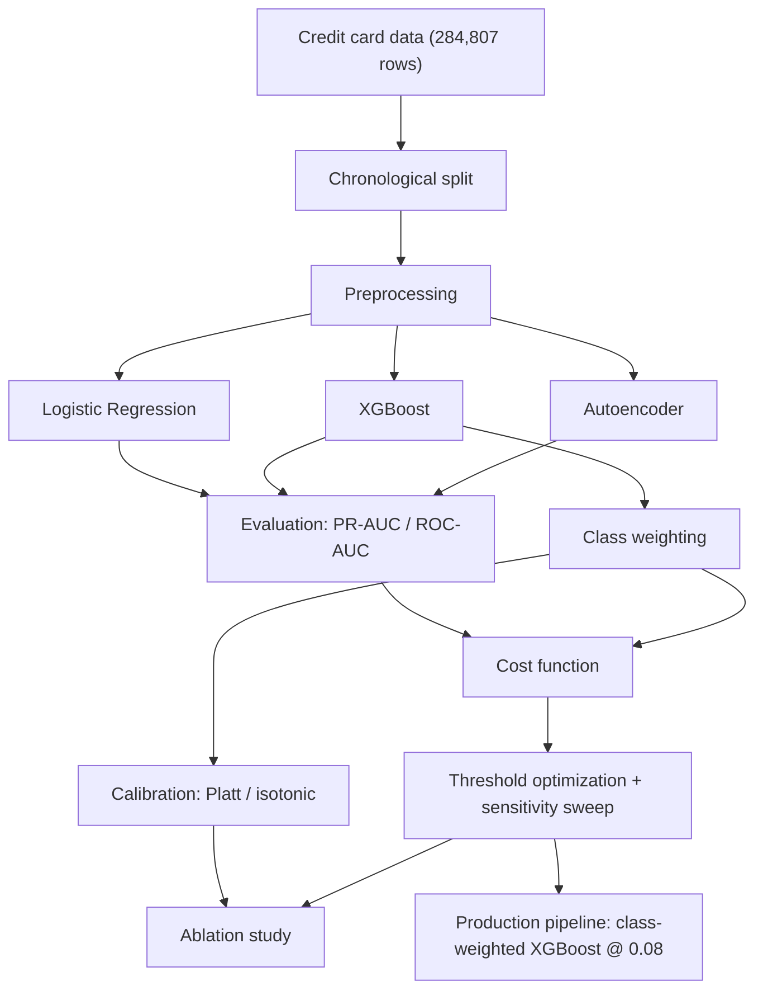
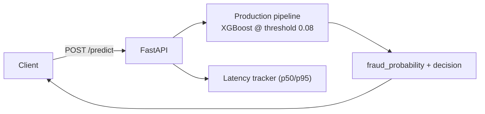
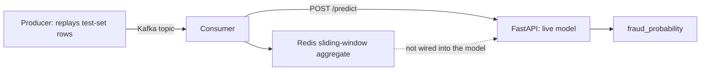

# Cost-Sensitive Fraud Detection with Threshold Optimization

[](https://github.com/Charith-Reddy-Pareddy/Cost-Sensitive-Fraud-Detection-with-Threshold-Optimization/actions/workflows/tests.yml)
[](LICENSE)

## Why this project?

Fraud detection is not an accuracy-maximization problem. Missing a fraudulent transaction and
blocking a legitimate customer have very different costs. This project studies how model choice,
class-imbalance strategy, and decision threshold affect that cost tradeoff — as a family of
loss functions swept across a wide range of cost ratios, not a single invented number — then
deploys the selected model behind a low-latency API.

| | |
|---|---|
| Best model | XGBoost (class-weighted) |
| Best imbalance strategy | Class weighting (beats SMOTE) |
| Cost-optimal threshold (at illustrative $500/$5 costs) | 0.08 |
| Cost reduction vs. default threshold | 13.3% (95% bootstrap CI: −5.1% to 33.9%) |
| Inference latency | 1.42ms p50 / 2.14ms p95 |

That confidence interval is reported deliberately, not tucked away — see
[Statistical stability](#statistical-stability) below.

A production-style prototype (not a production-ready system — see [Dataset](#dataset) for why)
that handles severe class imbalance and optimizes fraud decisions against real business cost.
Three modeling approaches are compared honestly (including failure modes), decision thresholds
are optimized against a financial loss function across a swept range of cost ratios, and the
selected model ships behind a working low-latency inference service rather than a notebook.

**Core research question:** which modeling approach performs best under severe class imbalance,
and how does optimizing the decision threshold against a cost function change the tradeoff
between fraud detection and false positives — including how that optimum shifts as the cost
ratio changes?

See [`PLAN.md`](PLAN.md) for the day-by-day build plan this repo followed.

## Dataset

**Primary:** [Credit Card Fraud Detection](https://www.kaggle.com/mlg-ulb/creditcardfraud)
(Kaggle) — anonymized (PCA-transformed) European card transactions, single day, 284,807 rows,
492 fraud (0.17%).

**Known limitations (stated upfront) — this is why "production-style prototype," not
"production system":**
- Single-day sample limits the ability to model concept drift over time.
- Heavy PCA anonymization (`V1`..`V28`) removes real-world feature semantics.
- Risk of temporal leakage if train/test splits aren't done chronologically — mitigated here by
  splitting on `Time` rather than randomly (see [`src/data/ingest.py`](src/data/ingest.py)).
- The fraud/blocked-transaction dollar costs used in the cost engine below are **illustrative
  assumptions** for demonstrating the method, not sourced figures — see
  [Cost-sensitive decision engine](#cost-sensitive-decision-engine) for why the sweep across
  cost ratios matters more than any single dollar figure.
- Only 492 fraud examples total; see [Statistical stability](#statistical-stability) for how
  much that limits precision on point estimates.

Detailed EDA (class balance, amount/time distributions, correlation structure) lives in
[`notebooks/01_eda.ipynb`](notebooks/01_eda.ipynb) rather than here, to keep this README focused
on architecture, cost curves, and latency.

## Architecture

**Offline experimentation pipeline** — everything that produces the numbers in this README:



**What's actually served** — the live inference path, separate from the analysis above:



Every training run logs params/metrics/artifacts to MLflow (project-local SQLite store,
`mlflow.db`, gitignored — run `mlflow ui --backend-store-uri sqlite:///mlflow.db` to browse).

## Modeling: three approaches, compared honestly

| Model | PR-AUC | ROC-AUC | F1 @ 0.5 |
|---|---|---|---|
| Logistic Regression | 0.744 | 0.979 | 0.678 |
| XGBoost (no imbalance handling) | 0.671 | 0.976 | 0.756 |
| **Autoencoder** (reconstruction error, unsupervised) | **0.272** | 0.922 | — |

The autoencoder is trained only on legitimate transactions and never sees a labeled fraud
example. Fraud rows get ~18x higher mean reconstruction error than legitimate ones (4.70 vs.
0.25), which is why ROC-AUC still looks reasonable (0.922) — but PR-AUC collapses to 0.272. That
gap is the finding: reconstruction error assumes fraud is statistically anomalous, which is only
partly true here — some fraud reconstructs about as well as an ordinary transaction, and some
unusual-but-legitimate transactions reconstruct as badly as fraud does. Full writeup:
[`docs/day3_autoencoder_and_imbalance_analysis.md`](docs/day3_autoencoder_and_imbalance_analysis.md).

## Handling class imbalance

Resampling is applied **inside** the training pipeline only (never before the train/test split)
to avoid leakage. SMOTE is treated as one experimental comparison point, not the default.

| Strategy (XGBoost) | PR-AUC | ROC-AUC | F1 @ 0.5 |
|---|---|---|---|
| None | 0.671 | 0.976 | 0.756 |
| **Class weighting** | **0.786** | **0.986** | **0.765** |
| SMOTE | 0.777 | 0.977 | 0.667 |

Class-weighting wins outright, including F1 at the default threshold. SMOTE improves PR-AUC over
the unweighted baseline but costs real precision at the default threshold (F1 drops from 0.756 to
0.667) — synthetic minority samples shift the decision boundary in a way that doesn't fully
generalize. Class-weighting is the strategy carried forward into the cost-sensitive threshold
work below.

## Probability calibration

Threshold optimization implicitly assumes the model's scores mean something as probabilities.
This checks that assumption directly: fit the class-weighted XGBoost model on 85% of the
training period, hold out the last 15% (still chronologically before the test set) as a
calibration slice, fit Platt scaling and isotonic regression on it, then compare raw vs.
calibrated Brier scores and cost-optimal thresholds on the untouched test set
([`src/models/run_calibration_analysis.py`](src/models/run_calibration_analysis.py)):


| Method | Brier score | Cost-optimal threshold | Expected cost |
|---|---|---|---|
| Raw | 0.00054 | 0.030 | $6,835 |
| Platt scaling | 0.00050 | 0.020 | $8,085 |
| **Isotonic regression** | **0.00043** | 0.020 | $7,510 |

**Calibration does change the cost-optimal threshold** — and the result is more nuanced than
"calibration helps": isotonic regression gives the best-calibrated probabilities (lowest Brier
score) and the lowest cost among the calibrated options, but Platt scaling, despite also
improving calibration over the raw scores, actually *increases* expected cost relative to the
raw, uncalibrated model. Better calibration (lower Brier) does not automatically mean better
cost-optimized decisions — the two objectives are related but not the same thing. (Numbers on
this page use a training subset held back for calibration, so they differ slightly from the
full-training-set numbers used elsewhere; see the [ablation study](#ablation-study) for a
fair side-by-side under matched conditions where that's feasible.)

## Cost-sensitive decision engine

The primary claim of this project isn't "$500 and $5 are the right costs" — it's that **sweeping
a family of asymmetric loss functions reveals how the optimal operating point moves**, which no
single fixed-cost scenario can show. The $500/$5 scenario below is one illustrative point on
that sweep, used consistently across sections for comparability.

Illustrative costs: **$500** per missed fraud (false negative), **$5** per blocked legitimate
transaction (false positive) — assumptions for demonstrating the method, not sourced figures.


| | Threshold | Expected cost (test set) |
|---|---|---|
| Default | 0.50 | $9,085 |
| **Cost-optimized** | **0.08** | **$7,880** |

**13.3% reduction in expected financial loss** versus the default 0.5 threshold, on the
class-weighted XGBoost model (95% bootstrap CI: −5.1% to 33.9% — see
[Statistical stability](#statistical-stability)).

### What moving the threshold actually costs you

The core tradeoff, made concrete
([`src/models/run_threshold_comparison.py`](src/models/run_threshold_comparison.py)):

| Threshold | Precision | Recall | FP | FN | Expected cost |
|---|---|---|---|---|---|
| 0.50 | 0.770 | 0.760 | 17 | 18 | $9,085 |
| 0.20 | 0.464 | 0.773 | 67 | 17 | $8,835 |
| **0.08 (cost-optimal)** | **0.257** | **0.813** | **176** | **14** | **$7,880** |
| 0.05 | 0.160 | 0.827 | 326 | 13 | $8,130 |
| 0.02 | 0.077 | 0.880 | 795 | 9 | $8,475 |

Lowering the threshold catches more fraud (recall climbs from 0.760 to 0.880) but floods the
review queue with false positives (17 → 795) — at $500/$5, the sweet spot lands at 0.08, not at
either extreme.

### Cost-ratio sensitivity sweep

Sweeping the ratio of (cost of missed fraud) / (cost of a blocked transaction) — not just one
fixed value — shows how the optimal threshold moves as that ratio changes, with the precision/
recall/false-positive-rate tradeoff it implies at each point
([`src/models/run_threshold_comparison.py`](src/models/run_threshold_comparison.py)):


| Cost ratio | Optimal threshold | Precision | Recall | FPR |
|---|---|---|---|---|
| 1 | 0.91 | 0.917 | 0.733 | 0.0001 |
| 5 | 0.84 | 0.889 | 0.747 | 0.0001 |
| 10–25 | 0.42 | 0.725 | 0.773 | 0.0004 |
| 50 | 0.12 | 0.335 | 0.800 | 0.0021 |
| 100 | 0.08 | 0.257 | 0.813 | 0.0031 |
| 250–500 | 0.01 | 0.043 | 0.920 | 0.0270 |

As missing fraud becomes relatively more expensive, the optimizer accepts more false positives
to catch more fraud — recall climbs from 0.733 to 0.920 while precision falls from 0.917 to
0.043 across the swept range. That's the actual contribution of this section: not a threshold,
but a map of how the threshold should move as business priorities shift.

## Statistical stability

Fraud is 0.17% of this dataset — a single chronological test split (75 fraud rows out of
56,962) is not a lot of positive examples to draw firm conclusions from. Bootstrap resampling
(1,000 resamples, 95% CI) on the production model's real test-set predictions quantifies that
directly ([`src/models/run_bootstrap_analysis.py`](src/models/run_bootstrap_analysis.py)):

| Metric | Point estimate | 95% CI |
|---|---|---|
| PR-AUC | 0.786 | [0.690, 0.878] |
| Precision @ 0.08 | 0.257 | [0.205, 0.314] |
| Recall @ 0.08 | 0.813 | [0.714, 0.903] |
| Expected cost @ 0.08 | $7,880 | [$4,360, $11,885] |
| Cost reduction vs. default | 13.3% | [−5.1%, 33.9%] |

That last row is the important one to sit with: the point estimate says the optimized threshold
beats the default, but the interval includes negative values — on an unlucky resample, the
"optimized" threshold could come out worse than 0.5. With only 75 positive test examples, that's
an honest reflection of the data's limits, not a flaw in the method. It's also a concrete
argument for why this reads as a *prototype* result rather than a production-validated one.

## Model interpretability

SHAP (`TreeExplainer`) over the class-weighted XGBoost model, sampled 2,000 test rows
(all fraud rows plus a matched legitimate sample, since fraud is too rare to show up reliably in
a plain random sample):


`V14`, `V4`, and `V12` are the strongest drivers, consistent with published analyses of this
dataset that repeatedly identify `V14`/`V12`/`V10`/`V17` as the components carrying the most
fraud signal — despite `V1`..`V28` having no semantic meaning on their own (PCA components, not
named business features).

## Ablation study

What does each design decision actually contribute, in isolation
([`src/models/run_ablation_study.py`](src/models/run_ablation_study.py))? Configs 1–3 share one
XGBoost fit on the full training set; config 4 needs a calibration holdout, so it's fit on the
same 85% training slice used above — trained on slightly less data than 1–3, noted rather than
glossed over.

| Configuration | PR-AUC | Expected cost |
|---|---|---|
| No weighting + threshold 0.5 | 0.788 | $11,020 |
| Class weighting + threshold 0.5 | 0.786 | $9,085 |
| Class weighting + optimized threshold (0.08) | 0.786 | $7,880 |
| Class weighting + isotonic calibration + optimized threshold (0.02) | 0.722 | $7,510 |

The most counter-intuitive line is the first two: class weighting barely moves PR-AUC (0.788 →
0.786, within noise) but cuts expected cost by nearly $2,000 — because PR-AUC is a
threshold-independent ranking metric, while cost depends on *where* the probability mass sits
relative to a fixed decision boundary. Two models can rank transactions almost identically and
still produce very different real-world costs. This is the concrete case for why PR-AUC alone
was never going to be enough to select a deployment threshold — the framing note in the original
project plan, borne out numerically.

## Inference service

A FastAPI service (`src/serving/app.py`) loads the persisted production pipeline — the
class-weighted XGBoost model at its cost-optimized threshold (0.08) — and exposes:

| Endpoint | Description |
|---|---|
| `GET /health` | liveness + current decision threshold |
| `POST /predict` | score a single transaction |
| `POST /replay?n=&delay_ms=` | replay `n` real test-set rows with a small delay, scoring each |
| `GET /latency` | p50/p95 over every prediction served so far |
| `GET /docs` | interactive Swagger UI (auto-generated by FastAPI) |

Latency, measured from 5,000 real served predictions (replay + individual calls):


**p50: 1.42ms, p95: 2.14ms** — comfortably low-latency for a synchronous scoring call.

### Live demo

```bash
uvicorn src.serving.app:app --reload
```

Then open `http://localhost:8000/docs` for the interactive Swagger UI, or call it directly:

```bash
curl -X POST localhost:8000/predict -H "Content-Type: application/json" -d '{
  "Time": 120000, "V1": -2.31, "V2": 1.95, "V3": -3.62, "V4": 3.11, "V5": -1.84,
  "V6": -0.55, "V7": -2.77, "V8": 0.66, "V9": -1.88, "V10": -3.99, "V11": 2.90,
  "V12": -4.30, "V13": 0.24, "V14": -5.10, "V15": 0.51, "V16": -1.63, "V17": -1.83,
  "V18": -0.11, "V19": 0.34, "V20": 0.20, "V21": 0.11, "V22": 0.20, "V23": -0.08,
  "V24": -0.11, "V25": 0.25, "V26": 0.10, "V27": 0.10, "V28": 0.04, "Amount": 99.99
}'
```

```json
{
  "fraud_probability": 0.913,
  "is_fraud": true,
  "threshold": 0.08,
  "latency_ms": 1.6
}
```

```bash
curl -X POST "localhost:8000/replay?n=500&delay_ms=1"
curl localhost:8000/latency
```

## Streaming prototype: Kafka → Redis (not model-connected)

`docker-compose.yml` also brings up a streaming demo — deliberately kept separate from the
inference path above, both architecturally and in this README:



A producer replays test-set transactions onto a Redpanda (Kafka-API-compatible) topic with a
small delay; a consumer reads that stream, maintains a Redis-backed sliding-window feature
(rolling transaction count and amount sum over the last 30 seconds — global rather than
per-card, since this dataset has no card/merchant ID to key on), scores each transaction against
the live FastAPI service, and logs the result. Verified end-to-end via `docker compose up`:

```
amount=$892.16 fraud_probability=0.1286 is_fraud=True window[30s]: count=148 sum=$24602.63
```

**This is a genuine, working streaming feature-store mechanism — and it is explicitly not an
input the trained model uses.** The dashed line in the diagram above is not a simplification;
it's the actual current state. Wiring the sliding-window aggregate into the model would mean
retraining on a feature that doesn't exist in the static offline dataset used here. This
demonstrates the full mechanism the architecture calls for; feeding it into the model is exactly
the kind of thing the [What I'd do with more data](#what-id-do-with-more-data) section gestures
at, not a claim already made.

```bash
docker compose up --build
```

## Repository structure

```
├── PLAN.md                          7-day build plan
├── DEBUGGING_EXERCISE.md            controlled debugging exercise writeup (Day 7)
├── docs/                            per-day analysis writeups
├── data/
│   ├── raw/                         gitignored — populated via kaggle CLI, see below
│   └── processed/                   gitignored — populated via src/data/ingest.py
├── notebooks/                       appendix EDA notebook
├── reports/figures/                 generated plots referenced above
├── src/
│   ├── data/                        ingestion, chronological split
│   ├── features/                    shared preprocessing pipeline
│   ├── models/                      training pipelines, cost engine, calibration,
│   │                                 bootstrap CIs, SHAP, ablation study
│   ├── serving/                     FastAPI inference service
│   └── streaming/                   Kafka/Redpanda → Redis stretch goal
├── tests/                           pytest suite
├── .github/workflows/               CI (runs the test suite on every push)
├── docker-compose.yml
└── requirements.txt
```

## Reproducing this locally

```bash
python3 -m venv .venv && source .venv/bin/activate
pip install -r requirements.txt

kaggle datasets download -d mlg-ulb/creditcardfraud -p data/raw
unzip data/raw/creditcardfraud.zip -d data/raw && rm data/raw/creditcardfraud.zip

python -m src.data.ingest
python -m src.models.train_baseline
python -m src.models.train_autoencoder
python -m src.models.imbalance_comparison
python -m src.models.run_cost_analysis
python -m src.models.run_shap_analysis
python -m src.models.train_production_model
python -m src.models.run_calibration_analysis
python -m src.models.run_bootstrap_analysis
python -m src.models.run_threshold_comparison
python -m src.models.run_ablation_study

pytest tests/ -q
```

**Environment note:** XGBoost and PyTorch each bundle their own OpenMP runtime; running both in
one process crashes on macOS unless `OMP_NUM_THREADS=1` is set (already handled in
[`src/__init__.py`](src/__init__.py)). `xgboost` is pinned below 3.0 because SHAP 0.49.1's
`TreeExplainer` can't yet parse XGBoost 3.x's `base_score` serialization format.

## What I'd do with more data

- Multi-day/multi-month data to actually study concept drift, instead of a single-day snapshot.
- Real merchant/geo/entity fields (e.g. the Sparkov-simulated dataset) for genuine feature
  engineering — spatial distance between sequential transactions, per-card velocity — instead of
  working only with anonymized PCA components.
- A live transaction stream instead of a static replay for the serving layer, with the Redis
  sliding-window aggregate actually wired into the model as a trained feature, not just logged
  alongside it.
- More fraud examples — with only 492 positive rows total, the bootstrap CIs above are wide
  enough that a production deployment would need materially more labeled fraud before trusting
  a single point estimate.

This section is meant to signal awareness of this project's ceiling, not to pretend it's bigger
than it is.

## License

[MIT](LICENSE)
