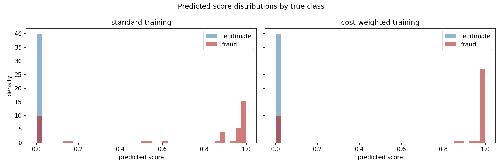
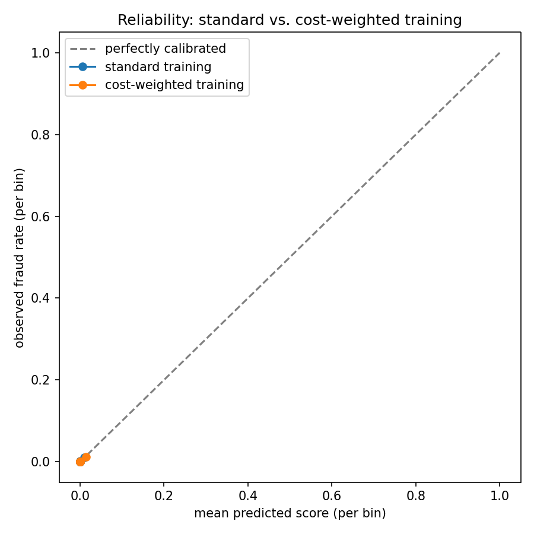
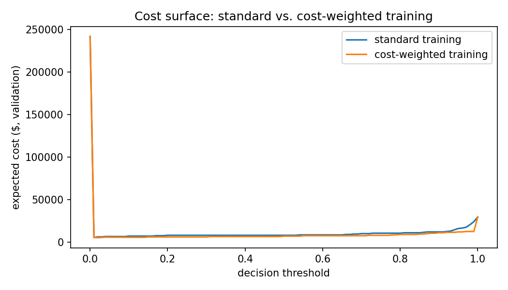
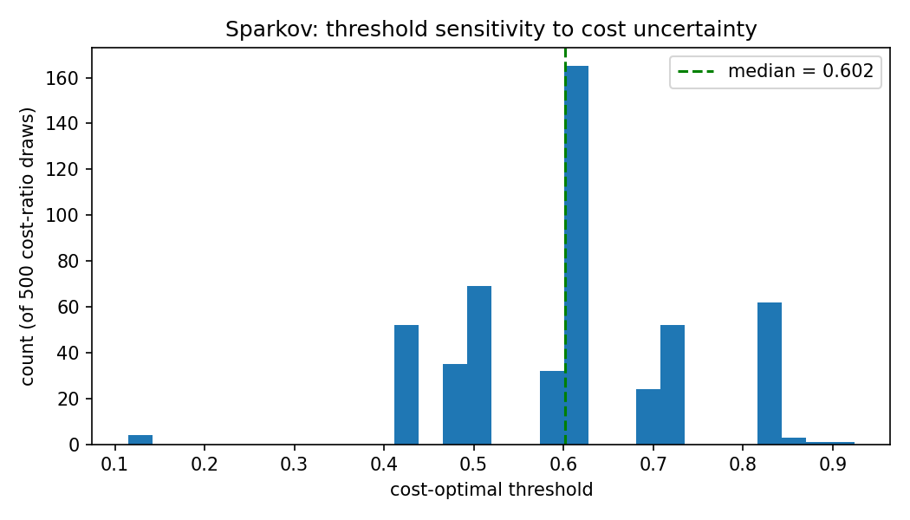
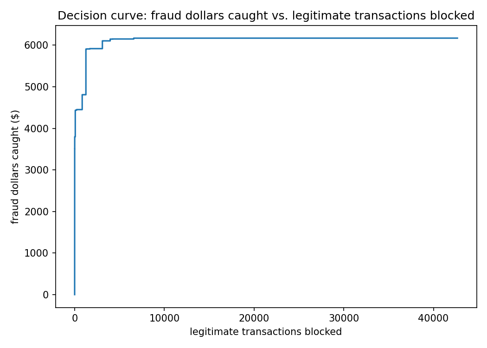

# How Robust Is Cost-Sensitive Threshold Optimization Under Temporal Shift and Cost Uncertainty?

## Problem

Fraud detection under severe class imbalance is usually framed as a model-selection problem:
pick the classifier with the best PR-AUC. But PR-AUC is threshold-independent, while the actual
business decision — block this transaction or not — happens at a single, chosen threshold. Two
models can rank transactions almost identically and still produce very different real-world
costs, depending on where their probability mass sits relative to that threshold (see the
[ablation study](#4-does-training-time-cost-sensitivity-add-anything-over-threshold-tuning)
below). This project's original framing was: pick the best model, then optimize its decision
threshold against an explicit cost function. That framing turned out to have a real
methodological gap, described next.

Throughout this report, "**predictive model**" means the classifier that ranks transactions by
fraud likelihood (evaluated by PR-AUC, Brier score, calibration), and "**decision policy**" means
whatever turns that ranking into a block/allow call (a threshold, a top-K cutoff, a calibrated
expected-loss ranking — see Experiment 6). Cost-sensitivity can be built into either layer
independently, or both — that's the substance of Experiments 4, 4b, and 4c, and the sharper
version of this report's research question: not just "does cost-sensitive thresholding help,"
but **when should cost asymmetry be incorporated during training versus at decision time, and
what happens when it's applied to both?**

## Hypothesis

Cost-sensitive threshold optimization reduces expected financial loss relative to a default 0.5
threshold — but the sharper, more useful question is **how robust that improvement is**: does it
hold up out-of-sample, across different time windows, under uncertainty about the assumed cost
ratio, and on a structurally different dataset? A method that only wins on the exact split it was
tuned on is a weaker result than one that wins consistently.

## Method

**The methodological fix this report exists to document:** earlier versions of this project
selected the decision threshold using the *test set's* labels — `optimize_threshold(...)` was
called with `y_test`, then the resulting cost reduction was reported on that same test set. That
makes the test set part of model selection, not a genuine held-out evaluation. Every experiment
below instead uses a strict **train (68%) → validation (17%) → test (15%)** chronological split:

- The model is fit on `train` only.
- Every threshold, calibrator, or hyperparameter choice is selected on `val` only.
- `test` is touched exactly once, for final reporting, and never used to pick anything.

All splits are chronological (sorted by transaction time, not shuffled), for the same reason
stated throughout this project: a random split lets the model see transactions that happen after
the ones it's evaluated on.

**Hyperparameter selection protocol.** Every XGBoost model in this project — primary and
Sparkov, every experiment — uses the same fixed hyperparameters: `n_estimators=200, max_depth=4,
learning_rate=0.1`. These were **not tuned**: no grid search, random search, or Bayesian
optimization was run over them, and no value was ever chosen by looking at validation or test
performance. They are reasonable defaults for a dataset of this size and were fixed once at the
start of the project, before any evaluation numbers existed to influence the choice. This rules
out one specific failure mode — outcome-influenced hyperparameter selection quietly inflating the
reported results — but it does not mean these are good hyperparameters. A hyperparameter sweep
(inner train→val tuning, never touching test) is listed as future work; the honest reading of
every result in this report is "with untuned, fixed XGBoost hyperparameters," not "with the best
model this method could produce."

## Experiments

### 1. Does the corrected protocol change the headline result?

Yes, substantially. Under the old (leaking) protocol, the reported cost reduction from
threshold optimization was 13.3%. Under the corrected protocol — threshold selected on val,
evaluated once on test — it drops to **2.4%** ($6,575 → $6,415 on the $500/$5 scenario). The
original number was inflated by selecting the threshold against the same data used to report the
improvement. This is the single most important correction in this report.

A related, smaller finding from the same run: the val-selected "optimal" threshold (0.09) is not
actually the lowest-cost point on test — threshold 0.05 achieves a lower test cost ($6,135 vs.
$6,415). That's not a bug; it's the val→test generalization gap made visible, exactly what a
held-out test set is supposed to expose.

#### 1b. Is the grid itself limiting the result?

The 2.4% headline number, and every other threshold-based result in this report, selects the
threshold from a fixed 101-point grid (`np.linspace(0, 1, 101)`, step 0.01). That's a
discretization choice, not a property of the method — the true cost-minimizing threshold can sit
between grid points. [`run_threshold_search_comparison.py`](src/models/run_threshold_search_comparison.py)
checks: does a finer grid, or an exact search over every observed score (O(n log n) via sorted
cumulative FN/FP counts, so it never misses the minimum), find something meaningfully better?

| Strategy | Threshold (val) | Test cost reduction vs. default |
|---|---|---|
| 101-point grid (step 0.01) — used for every other number in this report | 0.0900 | +2.43% |
| 1001-point grid (step 0.001) | 0.0190 | +4.56% |
| Exact empirical search (every observed score) | 0.0197 | +5.17% |
| Bayes-optimal (theoretical, `cost_fp/(cost_fn+cost_fp)`) | 0.0099 | −11.48% |

Yes — noticeably. The exact search's validation-set cost is $315 lower than the 101-point grid's,
and that gap is not just overfitting noise: it *also* more than doubles the test-set cost
reduction, from 2.4% to 5.17%. **The 2.4% headline is a lower bound on what this method can
achieve, not its ceiling** — it understates the benefit of cost-sensitive thresholding because of
grid coarseness alone, on top of everything else this report already treats as a source of
uncertainty (temporal instability, cost-ratio uncertainty, sampling noise).

The theoretical Bayes-optimal threshold (0.0099, derived from `cost_fp/(cost_fn+cost_fp)` under
the assumption of perfectly calibrated probabilities) is close in absolute terms to the empirical
optimum (0.0197) but performs *worse* on test (−11.48%, i.e. worse than doing nothing) — a small
absolute gap in a region where the cost curve is extremely steep translates into a large practical
difference, and this specific divergence is itself evidence the raw XGBoost scores are not
well-calibrated probabilities. That is investigated directly in the calibration comparison below.

**Scope note (updated as the propagation below progresses):** exact search is now the standard
for the production model, its bootstrap CI, and walk-forward evaluation (Days 1–2 of the
migration described in Future work). The cost-ratio sensitivity sweep below still selects
thresholds from the 101-point grid, pending a later day. An earlier version of this note
predicted that propagating exact search "would very likely widen the reported benefit, not
shrink it" — that held for the bootstrap point estimate (2.4%→5.17%) but **not** for walk-forward
stability, which got *worse* under exact search (2 of 4 folds worsened under the grid, 3 of 4
under exact search — see Experiment 2). The corrected expectation: exact search improves the
single-split point estimate but does not reliably improve — and can actively hurt —
cross-fold generalization, because it fits each validation split more tightly, including its
noise.

### 2. Is the result stable across time windows? (walk-forward evaluation)

The full dataset (sorted by time) is cut into 5 equal blocks. Fold *k* trains on an expanding
window (blocks 0..k-1), selects the threshold on the first half of block *k*, and reports on the
second half — so training data only ever grows forward in time.

| Fold | Train rows | Threshold (val) | Default cost (test) | Optimized cost (test) | Result |
|---|---|---|---|---|---|
| 1 | 56,961 | 0.0063 | $4,520 | $5,600 | worsened |
| 2 | 113,922 | 0.7781 | $5,180 | $6,625 | worsened |
| 3 | 170,884 | 0.7128 | $4,015 | $4,005 | improved |
| 4 | 227,845 | 0.0556 | $3,060 | $3,765 | worsened |

**The optimized threshold (exact search, as of the ongoing propagation described in Future work)
improved cost in 1 of 4 folds and made it worse in the other 3.** This table used to run on the
101-point grid and read improved 1/4, tied 1/4, worsened 2/4 — switching to exact search made
walk-forward *stability worse*, not better, losing the one tied fold entirely. That's a real,
counterintuitive finding worth sitting with: exact search improved the single-split headline
result (§1b, 2.4%→5.17%) precisely because it can fit that one validation half more tightly, but
the same tighter fit generalizes *worse* on average across four independent folds. The grid's
coarseness was accidentally acting as a mild regularizer against picking a threshold that overfits
one particular validation half; removing that discretization helps the lucky split and hurts the
unlucky ones. The selected threshold itself now swings even more widely across windows — 0.0063
to 0.7781, versus 0.04 to 0.62 under the grid — which is itself further evidence of the same
overfitting: exact search is free to chase each fold's validation noise all the way to its edges.
This dataset covers a single day, so it cannot test genuine multi-day concept drift — that
limitation is real and unavoidable here — but it does show the conclusion is not stable even
across different windows of a single day. A single-split result (Experiment 1) looked like a
clean win; four independent splits show it's worse than a coin flip, and a *better* threshold
search makes that worse, not better.

### 3. Is the selected threshold robust to uncertainty in the assumed cost ratio?

Every other experiment treats $500 (false negative) and $5 (false positive) as fixed and known.
Here, `cost_fn ~ Uniform(100, 1000)` and `cost_fp ~ Uniform(1, 20)` are drawn independently 500
times; for each draw, the cost-optimal threshold is selected on val.


Now exact search (Days 1–3 of the propagation described in Future work), not the 101-point grid:

| Statistic | Value (exact search) | Value (grid, for comparison) |
|---|---|---|
| Mean | 0.141 | 0.151 |
| Std. dev. | 0.187 | 0.178 |
| Median | 0.092 | 0.090 |
| IQR | [0.020, 0.092] | [0.090, 0.240] |
| Range | [0.008, 0.773] | [0.010, 0.750] |

The distribution is multi-modal — thresholds cluster at a handful of plateaus rather than
varying smoothly, itself a consequence of how few fraud examples (59) are in the validation
split. Mean, median, and range barely moved between the grid and exact search, but the IQR
shifted meaningfully lower and tightened (both bounds roughly halved) — the *typical* draw now
picks a noticeably more aggressive threshold than the grid found, even though the extremes of the
distribution are about the same. **The median (0.092) no longer matches the exact-search
point-estimate result from the $500/$5 scenario (0.020, §1b)** — under the grid, both calculations
agreed (0.090 for both), which this report previously read as "reassuring." That agreement turns
out to have been coincidental: the $500/$5 scenario is one specific point (cost ratio 100) inside
a distribution spanning roughly ratio 5 to ratio 1000, and there's no reason its point estimate
should equal the whole distribution's median — the grid just happened to produce the same value
for both by chance. The wider lesson: the spread itself (0.008 to 0.773) still means a materially
different but still plausible cost assumption would pick a very different operating point, and if
anything that conclusion is reinforced, not weakened, by exact search.

### 4. Does training-time cost-sensitivity add anything over threshold tuning?

Four configurations, same train/val/test protocol:

| Configuration | Threshold | PR-AUC | Recall | Expected cost |
|---|---|---|---|---|
| A: standard training, threshold 0.5 | 0.50 | 0.757 | 0.712 | $7,510 |
| B: standard training, optimized threshold | 0.01 | 0.757 | 0.750 | $6,795 |
| C: cost-weighted training, threshold 0.5 | 0.50 | 0.761 | 0.750 | $6,530 |
| D: cost-weighted training, optimized threshold | 0.02 | 0.761 | 0.750 | $7,070 |

"Cost-weighted training" here means the training sample weights are set directly to the dollar
costs (`$500` per fraud row, `$5` per legitimate row) — a genuinely different mechanism from
class weighting (which only encodes class *frequency*, not the actual dollar figures).

**C beats both B and D.** Cost-weighted training alone, at the plain default threshold, does
better than either decision-time threshold tuning alone or the two combined. Combining
training-time and decision-time cost-sensitivity (D) is not simply additive — it's *worse* than
cost-weighted training alone. The mechanism behind that — not just that it happens, but why — is
investigated directly next. This is the most interesting single result in this report: two
cost-sensitivity mechanisms that sound complementary in principle turn out to partially
substitute for, rather than reinforce, each other in practice.

#### 4b. Why does combining them hurt? A calibration explanation

The working hypothesis: cost-weighted training doesn't just shift where the decision boundary
*should* be — it distorts the score away from being a calibrated P(fraud) estimate, because the
fit is no longer optimizing to match observed frequencies, it's optimizing a cost-weighted
objective instead. If true, applying threshold tuning *on top of* those already cost-shifted
scores double-counts the cost asymmetry: once during training (via the sample weights) and again
during threshold selection — each reasonable on its own, but their combination overshoots.
[`run_calibration_mechanism_study.py`](src/models/run_calibration_mechanism_study.py) tests this
against five configurations and the theoretical Bayes-optimal threshold:

| Configuration | Brier (test) | Empirical threshold (val) | Gap to Bayes-optimal (0.0099) | Test cost |
|---|---|---|---|---|
| 1. Raw (standard training) | 0.00040 | 0.0053 | 0.0046 | $6,555 |
| 2. Platt-calibrated (standard training) | 0.00047 | 0.0005 | 0.0094 | $6,555 |
| 3. Isotonic-calibrated (standard training) | 0.00040 | 0.0256 | 0.0157 | $6,525 |
| 4. Cost-weighted (uncalibrated) | 0.00045 | 0.0246 | 0.0147 | $6,945 |
| 5. Cost-weighted + isotonic calibration | 0.00042 | 0.0196 | 0.0097 | $6,930 |

The hypothesis holds up on two independent pieces of evidence:

1. **Calibration quality itself is worse under cost-weighting.** Standard training's raw Brier
   score is 0.00040; cost-weighted training's is 0.00045 — measurably worse, exactly as expected
   if the cost-weighted objective trades calibration quality for cost-awareness rather than
   getting both for free.
2. **Every explicitly threshold-tuned configuration in this table — all five — costs more on
   test than cost-weighted training's own untouched default-0.5 decision ($6,530, Experiment 4's
   config C).** That includes the cost-weighted model tuned against its own validation scores
   (row 4: $6,945, $415 worse than just leaving it at 0.5). If cost-weighted training's default
   decision boundary is already close to cost-optimal for that distorted score space, further
   tuning has nothing left to correct and instead fits validation-split noise — consistent with
   double-counting, not with threshold tuning being independently useful on top.





The cost surface plot makes the mechanism visible directly. Both curves still have their global
minimum near threshold ≈0.01–0.02 — cost-weighting doesn't move *where* the optimum is — but away
from that sharp minimum, cost-weighted training's curve sits much lower across the broad middle
range: at threshold 0.5 standard training costs $8,000 on val versus cost-weighted training's
$7,015, and between 0.3–0.4 cost-weighted training already reaches $6,030–$6,525 (within ~20% of
its own $5,205 minimum) while standard training is still at $8,000–$8,015 (roughly 50% above its
own $5,385 minimum) over that same range. Cost-weighted training has already absorbed much of the
achievable benefit at moderate, less-extreme thresholds; standard training only captures it by
tuning aggressively toward the sharp minimum near 0.01. That leaves cost-weighted training's
*narrow* additional gain from further threshold tuning genuinely small relative to validation-
split noise — real room to overfit that noise instead of capturing signal, exactly what the D < C
result shows.

#### 4c. Is "C beats D" real, or noise from one 57,000-row split?

C and D use the exact same cost-weighted model and the exact same test rows — they differ only in
which threshold gets applied (0.5 vs. the val-selected 0.02) — which makes this a genuinely
*paired* comparison, not two independent ones. `paired_bootstrap_comparison`
([`src/models/bootstrap_evaluation.py`](src/models/bootstrap_evaluation.py)) resamples both
configurations on the same bootstrap draw each time, isolating the difference between them from
the sampling noise they'd otherwise both be equally subject to
([`run_paired_bootstrap_comparison.py`](src/models/run_paired_bootstrap_comparison.py), 1,000
resamples):

| | Value |
|---|---|
| Observed cost, C (threshold 0.5) | $6,530 |
| Observed cost, D (threshold 0.02) | $7,070 |
| Observed diff (C − D) | **−$540** |
| Paired bootstrap mean diff | −$541 |
| Paired bootstrap 95% CI | **[−$645, −$445]** |
| P(C beats D) | **1.000** |

The 95% CI excludes zero entirely, and C won in all 1,000 resamples. **This is not noise** — C
reliably beating D is a stable property of this model and this cost function on this dataset, not
an artifact of which 57,000 rows happened to land in the test split. That strengthens Experiment
4's conclusion considerably: the earlier framing ("D is worse than C") was a single-split point
estimate; this shows it holds up under resampling with about as much statistical confidence as a
1,000-sample bootstrap can offer.

### 5. Does any of this generalize to a structurally different dataset?

The primary dataset is anonymized PCA components with 492 fraud rows total — useful for method
demonstration, but a professor (or any careful reviewer) can't conclude the method works on real
fraud data from that alone. The [Sparkov-simulated fraud
dataset](https://www.kaggle.com/datasets/kartik2112/fraud-detection) (881,739 train rows, 4,989
fraud) has real merchant, category, and geolocation fields, enabling genuine feature engineering
— haversine distance between customer and merchant, transaction hour, customer age — instead of
working only with anonymized components. Same protocol, same $500/$5 costs, applied here.

| | Primary dataset | Sparkov |
|---|---|---|
| Baseline PR-AUC (no weighting) | 0.757 | **0.909** |
| Class weighting vs. baseline | **helps** (+0.001 PR-AUC, cost $7,510→$6,575) | **hurts** (0.909→0.882 PR-AUC) |
| Threshold optimization vs. default | **helps** (2.4% cost reduction) | **no effect** (val selects 0.50, 0% reduction) |

**Neither conclusion from the primary dataset replicates on Sparkov.** The likely explanation is
that Sparkov's engineered features (distance, category, amount) separate fraud from legitimate
transactions far better than anonymized PCA components do — the baseline model is already at
PR-AUC 0.909 / ROC-AUC 0.998 without any imbalance handling. When a model already separates
classes almost perfectly, there's much less room for either class-weighting or threshold-tuning
to help, and rebalancing can actively distort an already well-calibrated ranking. This is not a
failure of the method — it's evidence that its *value* is dataset-dependent, concentrated in
regimes where the raw signal is weak, which is itself a useful, non-obvious finding this project
would not have produced without a second dataset.

#### 5a. Adding a real per-entity feature, and repeating Experiments 2–3 on Sparkov

Unlike the primary dataset, Sparkov has a card identifier (`cc_num`), which makes a genuine
per-entity feature possible: `card_txn_count_24h` / `card_amt_sum_24h`, a rolling count and
amount sum of that same card's transactions in the preceding 24 hours, computed causally
(`closed="left"` — the window is `[t-24h, t)`, strictly excluding the transaction's own row, so
it can never leak information about itself). Adding it and repeating the walk-forward and
bootstrap checks from Experiments 2–3, this time on Sparkov:

| | Sparkov, no velocity feature | Sparkov, + card velocity feature |
|---|---|---|
| Baseline PR-AUC (no weighting) | 0.909 | **0.969** |
| Threshold optimization vs. default (single split) | 0% reduction | **−1.8%** (actively worse) |
| Cost-reduction 95% bootstrap CI | [0.0%, 0.0%] | [−9.1%, 1.5%] |
| Walk-forward: improved / tied / worsened | 2 / 0 / 2 | **1 / 0 / 3** |

The velocity feature is a genuinely strong signal — it pushes an already-strong baseline from
0.909 to 0.969 PR-AUC — and it makes the "threshold optimization doesn't help here" finding
*more* decisive, not less: with a near-perfect model, optimizing the threshold has less room to
help and more room to overfit to the validation split's noise. This directly answers the
Limitations concern in the previous version of this report that the Sparkov comparison used only
one split — it doesn't anymore, and the repeated checks confirm the single-split result rather
than overturning it.

#### 5b. Closing the streaming gap: does the live feature actually reach the model?

The README's streaming section is explicit that the primary dataset's Redis sliding-window
aggregate is computed and logged but never fed into the model — there's no entity ID to key a
meaningful per-card feature on. Sparkov's `cc_num` removes that obstacle, so
[`src/streaming/run_sparkov_streaming_demo.py`](src/streaming/run_sparkov_streaming_demo.py)
replays 5,000 real transactions through a per-card Redis sliding window
([`src/streaming/redis_features_sparkov.py`](src/streaming/redis_features_sparkov.py)) and feeds
the *live* `card_txn_count_24h` / `card_amt_sum_24h` — not the offline, pre-computed version —
directly into `pipeline.predict_proba(...)` for each transaction, in real time. Verified output,
one card mid-fraud-burst:

```
cc_num=3573030041201292 amt=$8.28    live_card_txn_count_24h=4  fraud_probability=0.9999
cc_num=3573030041201292 amt=$353.57  live_card_txn_count_24h=5  fraud_probability=0.9998
cc_num=3573030041201292 amt=$876.10  live_card_txn_count_24h=6  fraud_probability=0.9997
...
cc_num=3573030041201292 amt=$233.53  live_card_txn_count_24h=11 fraud_probability=0.9983
```

47 fraud transactions were replayed, 87 flagged, 99.2% overall accuracy — but the number that
matters here isn't the accuracy, it's that `live_card_txn_count_24h` is visibly climbing
transaction-by-transaction as Redis accumulates state, and the model's prediction is responding
to that same live number. This is what "the streaming feature actually feeds the model" means in
practice, not just as a claim.

This mechanism is no longer only a replay script.
[`src/models/train_sparkov_production_model.py`](src/models/train_sparkov_production_model.py)
persists a real production pipeline (threshold selected on val, same protocol as everything
else), and [`src/serving/sparkov_app.py`](src/serving/sparkov_app.py) is a standing FastAPI
service that performs the same live Redis lookup per request — containerized
(`Dockerfile.sparkov-serving`, `docker compose up sparkov-api redis`) and verified to return the
identical probability inside and outside Docker for the same input. The primary dataset's
serving story (`src/serving/app.py`) and Sparkov's (`src/serving/sparkov_app.py`) now have
genuine parity, not just the primary dataset having a service and Sparkov having a demo script.

#### 5c. Does the training-objective finding (Experiment 4) also replicate on Sparkov?

Same four configurations as Experiment 4, on Sparkov with the velocity feature
([`src/models/run_sparkov_training_objective_comparison.py`](src/models/run_sparkov_training_objective_comparison.py)):

| Configuration | Threshold | PR-AUC | Recall | Expected cost |
|---|---|---|---|---|
| A: standard training, threshold 0.5 | 0.50 | 0.969 | 0.887 | $64,205 |
| B: standard training, optimized threshold | 0.02 | 0.969 | 0.977 | $18,305 |
| **C: cost-weighted training, threshold 0.5** | **0.50** | **0.969** | 0.980 | **$16,230** |
| D: cost-weighted training, optimized threshold | 0.38 | 0.969 | 0.982 | $16,495 |

**Yes — C beats both B and D here too.** ("Standard training" here has no weighting at all, not
even class weighting, so A's default threshold is badly miscalibrated — hence threshold tuning
alone (B) recovering most of the cost. But the comparable claim, C vs. D, replicates exactly: the
cheapest configuration is cost-weighted training at the plain default threshold, not the version
with a threshold additionally tuned on top of it.) Combined with Experiment 5a, every Sparkov
robustness check now agrees with its primary-dataset counterpart in direction, even where the
magnitudes differ substantially.

#### 5d. Is the Sparkov threshold also sensitive to cost-ratio uncertainty?

Experiment 3, repeated on Sparkov with the velocity feature — 500 independent
`cost_fn ~ Uniform(100, 1000)`, `cost_fp ~ Uniform(1, 20)` draws, threshold selected on val each
time ([`src/models/run_sparkov_cost_uncertainty_analysis.py`](src/models/run_sparkov_cost_uncertainty_analysis.py)):



| Statistic | Primary dataset (exact search) | Sparkov (exact search) |
|---|---|---|
| Mean | 0.141 | 0.606 |
| Median | 0.092 | 0.602 |
| Range | [0.008, 0.773] | [0.115, 0.924] |

**The character of the sensitivity is genuinely different, not just the numbers.** On the
primary dataset the threshold swings toward the aggressive end (near 0) as costs vary — a weak
model needs a low bar to catch fraud at all. On Sparkov it stays anchored in the 0.5–0.7 range
across nearly every draw — consistent with Experiments 5a–5c: a near-perfect model (PR-AUC
0.969) has much less to gain from moving the threshold around, regardless of the assumed cost
ratio. **Sparkov's numbers are essentially unchanged from the old grid-based run (mean 0.606→0.606,
median 0.600→0.602)**, while the primary dataset's did shift (§3) — a third, independent piece of
evidence for the same explanation: a near-perfect model has so little room left for the decision
threshold to matter that whether the search that picks it is coarse or exact barely registers,
while a weaker model (the primary dataset) is sensitive to both the cost assumption *and* the
precision of the search itself. All five Sparkov robustness checks now point the same direction:
the stronger the raw signal, the less any of this cost-sensitive machinery has left to
contribute — methodology included.

#### 5e. Row-level vs. card-level bootstrap: does clustering change the Sparkov intervals?

Every bootstrap CI in this report, including 5a–5d above, resamples individual rows (`bootstrap_ci`
in `src/models/bootstrap_evaluation.py`), which implicitly treats each row as independent
evidence. That's questionable on Sparkov specifically: `cc_num` means the same card generates many
transactions, and those transactions could plausibly be correlated (the same spending pattern, the
same compromise event). The primary dataset has no entity identifier, so this check is only
possible on Sparkov. [`run_sparkov_cluster_bootstrap_analysis.py`](src/models/run_sparkov_cluster_bootstrap_analysis.py)
resamples whole cards instead of rows (`cluster_bootstrap_ci`) and compares interval widths
directly against the row-level bootstrap, on the same test predictions (194,501 rows, 947 unique
cards):

| Metric | IID (row-level) 95% CI | Cluster (card-level) 95% CI | Width ratio (cluster / IID) |
|---|---|---|---|
| PR-AUC | [0.9577, 0.9737] | [0.9593, 0.9734] | 0.88 |
| Precision @ 0.51 | [0.4340, 0.4728] | [0.4320, 0.4720] | 1.03 |
| Recall @ 0.51 | [0.9731, 0.9889] | [0.9737, 0.9885] | 0.94 |
| Expected cost @ 0.51 | [$12,944, $21,956] | [$13,089, $21,903] | 0.98 |

**This is a genuine negative result, reported as one rather than reframed.** The methodological
concern behind clustering is real — row-level resampling *can* understate uncertainty when rows
within a cluster are correlated — but on this specific test set it doesn't materially matter: the
cluster and row-level intervals are close to the same width (ratios 0.88–1.03), not the
substantially wider cluster interval the concern would predict if within-card correlation were
strong. The likely reason is structural, not a flaw in the method: this Sparkov split's 194,501
test rows sit on 947 cards (~205 transactions per card on average), and if fraud events are spread
fairly evenly across many different cards rather than concentrated in a small number of
compromised ones, then each row genuinely does carry close to independent information about the
outcome, regardless of sharing a card ID. Cluster bootstrapping is still the methodologically
correct default whenever a natural grouping exists — it can only reveal understated uncertainty,
never hide overstated uncertainty — it simply turned out not to change the conclusion here.

### 6. What changes under amount-proportional costs and a fixed review capacity?

Every experiment so far uses one flat cost per class: $500 for any missed fraud, $5 for any
blocked legitimate transaction, regardless of the transaction's actual dollar amount. That's a
simplification worth stress-testing directly.
[`run_decision_policy_analysis.py`](src/models/run_decision_policy_analysis.py) switches to
`amount_proportional_fn_cost` — the false-negative cost of a missed fraud becomes its own
transaction amount (floored at $5, no recovery/chargeback modeling) — and asks three questions
against that more realistic cost model, on the primary dataset's val/test split.

**6a. Does the optimal threshold change?** Substantially. Under flat costs the val-selected
threshold is 0.0197 (Experiment 1b's exact search); under amount-proportional costs it jumps to
**0.8758** — a completely different operating point. The reason follows directly from the cost
ratio: the flat model assumes every fraud costs $500 against a $5 false-positive cost (ratio
100:1), which justifies flagging almost anything with any real fraud signal. The actual test-set
fraud amounts average far below $500 (total fraud-dollar exposure in the test split is only
$6,260.74 across 52 fraud rows, i.e. ~$120/fraud on average), so the *effective* cost ratio for a
typical fraud in this data is much closer to 1:1 — which justifies a far more conservative
threshold. Evaluated on test, the amount-proportional threshold costs $2,678.65 versus $2,967.12
if the flat-selected threshold (0.0197) were used instead on the same amount-weighted cost
function — a real, non-trivial difference driven entirely by which cost model is assumed.

**6b. The decision curve.** Sweeping the threshold and tracking (legitimate transactions blocked,
fraud dollars caught) traces the Pareto frontier a fraud-ops team actually faces — you cannot buy
more fraud dollars caught without also buying more blocked legitimate transactions:



At 10 legitimate transactions blocked, $3,796 in fraud is already caught; the curve is flat from
10 to 50 blocked (no additional fraud in that stretch of the ranking), then rises again to $4,430
by 100 blocked and $4,450 by 300 — steeply diminishing returns past the first ~100 blocked
transactions.

**6c. Capacity-constrained review (K=100, illustrative).** If a review team can only act on a
fixed number of transactions rather than "however many clear the threshold," four policies
diverge in an important way that the flat-cost model *cannot* reveal — under flat per-class costs,
ranking by raw score, by expected dollar loss (`proba × amount`), and by calibrated expected loss
all preserve the *same* rank order (every fraud is worth the same $500, so higher probability
always means higher expected value). Amount-proportional costs break that: probability and dollar
value can now trade off against each other, which is exactly what makes "cost-sensitive ranking"
a genuinely different policy from "top-K by score" — not just a special case of it.

| Policy | # flagged | Fraud caught (events) | Recall | Fraud $ caught | $ recall | Legit blocked |
|---|---|---|---|---|---|---|
| Static threshold (0.0197, uncapped) | 289 | 42/52 | 0.808 | $4,450.15 | 0.721 | 247 |
| Top-K by raw score (K=100) | 100 | 39/52 | 0.750 | $3,796.48 | 0.615 | 61 |
| Top-K cost-sensitive: `proba × amount` (K=100) | 100 | 17/52 | 0.327 | $4,392.51 | 0.712 | 83 |
| Top-K calibrated: `calibrated_proba × amount` (K=100) | 100 | 21/52 | 0.404 | $4,413.81 | 0.715 | 79 |

Only 46 of the 100 top-K-by-score and top-K-cost-sensitive selections overlap — these are
genuinely different sets of transactions, not a reordering of the same ones. The static,
uncapped threshold catches the most fraud on both axes, but at the cost of flagging 289
transactions (2.9× the review capacity) — not a policy a capacity-constrained team could actually
run. Among the capacity-constrained options, **top-K by raw score catches more individual fraud
cases (39 vs. 17-21) while cost-sensitive ranking catches more fraud dollars with far fewer
cases caught (17 events for $4,393 vs. 39 events for $3,796)** — cost-sensitive ranking
concentrates the fixed review budget on a small number of large-dollar frauds and gives up on
many small-dollar ones entirely, since each one contributes little to the total-dollar objective
it's actually optimizing. Which policy is "better" is a genuine business-values question this
report cannot answer for the reader: minimizing total dollar loss and minimizing the number of
customers who experience fraud are different objectives, and this table is the first place in the
project where that distinction has real, measurable teeth.

### 7. Is any of this XGBoost-specific?

Every experiment so far uses one model. Two additional, deliberately different families —
bagging (Balanced Random Forest) and a linear model (isotonic-calibrated logistic regression) —
test whether "cost-sensitive threshold optimization has a real but modest benefit" is a property
of the method or an artifact of XGBoost specifically
([`run_baseline_model_comparison.py`](src/models/run_baseline_model_comparison.py); same
train→val-select→test-report protocol, exact threshold search):

| Model | PR-AUC (test) | Brier (test) | Threshold (val) | Test cost reduction vs. default |
|---|---|---|---|---|
| XGBoost (class-weighted) | 0.758 | 0.00061 | 0.0197 | +5.17% |
| Balanced Random Forest | 0.767 | 0.01826 | 0.5380 | +6.84% |
| Calibrated logistic regression | 0.711 | 0.00049 | 0.0105 | **+38.33%** |

**The core finding generalizes, and on two of three model families it's considerably stronger
than the XGBoost result this whole report is built around.** All three models find a real,
positive cost reduction from threshold optimization — this isn't an XGBoost artifact. The
magnitude varies a lot, though, and the calibrated logistic regression result is the most
striking: 38% versus XGBoost's 5%, even though its PR-AUC (0.711) is the *worst* of the three.
That's a useful reminder that PR-AUC (ranking quality) and cost-reduction-from-thresholding
(how much a bad default threshold was costing) are different properties — a weaker-ranking model
can still have more room to gain from picking a better decision threshold than a
stronger-ranking one does, exactly the model-discrimination-vs-decision-policy distinction this
report treats as central. Balanced Random Forest's threshold (0.538) sits near 0.5 rather than
near 0 like the other two — a direct consequence of the model itself: each tree in the forest
already trains on an undersampled, class-*balanced* bootstrap, so its raw output is closer to a
genuinely balanced-decision score before any cost-sensitive threshold gets applied on top,
unlike XGBoost/logistic regression, which see the real, severely imbalanced class frequencies.

**A third family, LightGBM, was tried and excluded.** Under identical preprocessing, and even
with *no* class weighting applied to any of the three models, LightGBM scored PR-AUC ≈0.02-0.05
on this dataset versus XGBoost's 0.82 in the same no-weighting condition — not a close call. This
was investigated rather than dismissed: the same LightGBM configuration reaches PR-AUC 0.74-1.0
on synthetic data at a matched 0.17% imbalance ratio, ruling out a broken install or an inherent
inability to handle this level of imbalance. Several targeted fixes were tried and did not
resolve it — `is_unbalance=True`, relaxed `min_child_samples`/`min_split_gain`, single-threaded
execution, raw vs. `StandardScaler`-scaled features, and dropping the `Time`/`Amount` columns
entirely. The anomaly appears specific to something about this dataset's actual PCA-transformed
feature distributions interacting with LightGBM's histogram-based split-finding, and it was not
resolved within the scope of this report. Reporting a broken number to hit a round "3 of 3"
would be worse than documenting the gap honestly; this is flagged here, and in Future work, as
unresolved rather than fixed.

### 8. When does training-time cost-sensitivity substitute for, rather than complement,
decision-time thresholding? A synthetic factorial study

Every experiment so far answers this at one or two points in imbalance/signal/cost-ratio/
sample-size space — the real datasets available. That can't distinguish "this is how
cost-sensitivity works, generally" from "this is what happened to work on these two specific
datasets." [`run_synthetic_cost_sensitivity_study.py`](src/models/run_synthetic_cost_sensitivity_study.py)
runs a controlled factorial study on synthetic data (`sklearn.datasets.make_classification`),
independently varying four factors — class imbalance (0.5%/2%/8% fraud), signal strength
(`class_sep` 0.5/1.5/3.0), cost ratio (cost_fn/cost_fp 10/100), and sample size (5,000/50,000) —
3×3×2×2 = 36 cells × 3 seeds = 108 runs, repeating Experiment 4's A/B/C/D comparison
(standard @ 0.5, standard + tuned threshold, cost-weighted @ 0.5, cost-weighted + tuned threshold)
in each cell. Full results: [`results/synthetic_cost_sensitivity_study.csv`](results/synthetic_cost_sensitivity_study.csv).

**Scope, stated upfront (2 of the 6 originally-suggested factors are out of scope here):**
calibration error is measured as an *outcome* (each model's Brier score) rather than
independently injected, since doing that without also changing discrimination is its own
sub-project; temporal shift needs a synthetic generator with a drifting decision boundary, which
this script doesn't build. Both are listed under Future work rather than approximated.

**Overall, across all 108 runs:** threshold tuning beats the standard-model default 64.8% of the
time; cost-weighted training beats it 63.0% of the time; and — the specific question Experiment 4
raised on real data — combining cost-weighted training with threshold tuning beats cost-weighted
training alone only **50.9%** of the time, essentially a coin flip. The clearest signal is in
*when* that coin flip tips which way:

| Factor | Level | Cost-weighting helps (C beats A) | Combining helps further (D beats C) |
|---|---|---|---|
| Imbalance | 0.5% (severe) | 72.2% | **38.9%** |
| Imbalance | 2% | 61.1% | 50.0% |
| Imbalance | 8% (mild) | 55.6% | **63.9%** |
| Cost ratio | 10 | 66.7% | 37.0% |
| Cost ratio | 100 | 59.3% | 64.8% |
| Signal strength | weak (0.5) | 75.0% | 50.0% |
| Signal strength | strong (3.0) | 52.8% | 44.4% |
| Sample size | 5,000 | 55.6% | 50.0% |
| Sample size | 50,000 | 70.4% | 51.9% |

**Imbalance severity replicates the primary-dataset finding cleanly.** At the most severe
synthetic imbalance (0.5% fraud — close to the primary dataset's real 0.17%), cost-weighted
training alone is most likely to beat the default (72.2%) *and* adding threshold tuning on top is
least likely to help further (38.9% — i.e. more often than not, combining actively hurts). At
mild imbalance (8%), that flips: cost-weighting helps less often on its own (55.6%), but combining
helps more often (63.9%). This is exactly the shape of the primary-dataset result (severe
imbalance, cost-weighted training alone wins, tuning on top makes it worse) and it's not a
one-off — it's the dominant pattern across the grid, not just this project's specific dataset.

**Cost ratio does not point the same direction, and that's reported honestly rather than
smoothed over.** The primary dataset combines severe imbalance *and* a severe cost ratio
(100:1), and both "explanations" were plausible going in. This study can now separate them: at
the higher cost ratio (100), combining tuning with cost-weighted training helps *more* often
(64.8%), not less — the opposite of the imbalance-driven pattern. Taken together, this suggests
imbalance severity, not cost-ratio severity, is the more likely driver of the specific "D beats C"
failure seen on the primary dataset — but the two factors weren't cleanly separable in that single
real dataset, and this synthetic result is what makes that distinction visible at all.

**The §4b calibration mechanism does not clearly replicate here.** Experiment 4b's proposed
mechanism was that cost-weighted training measurably degrades calibration (worse Brier score),
which is why decision-time tuning on top double-counts the cost asymmetry. In this synthetic
sweep, that direction only holds at *mild* imbalance (mean Brier gap +0.054, cost-weighted
worse) — at *severe* imbalance, where the primary dataset actually sits and where §4b's finding
was made, cost-weighted training's Brier score is on average *better*, not worse (gap −0.025).
This is a genuine non-replication, not a footnote: it means §4b's specific calibration-based
explanation may be correct on the primary dataset without being the general mechanism — imbalance
severity's effect on the D-vs-C outcome (confirmed above) might run through a different or
additional pathway that this study wasn't designed to isolate. Reported as an open question, not
resolved here.

**Signal strength and sample size are secondary but consistent with intuition.** Weaker signal
(harder-to-separate classes) makes cost-weighted training more likely to help (75.0% vs. 52.8% at
strong signal) — a weak model has more room for any cost-sensitivity mechanism to move the needle.
Larger samples make cost-weighted training more reliably beneficial (70.4% vs. 55.6% at 5,000
rows) without much effect on whether combining helps further, consistent with cost-weighted
training needing enough data to actually learn the cost-shifted objective well.

## Statistical analysis

Fraud is 0.17% of the primary test split (52 of 42,721 rows) — not much to draw firm conclusions
from a single evaluation. Bootstrap resampling (1,000 resamples, 95% CI) on the production
model's val-selected threshold (0.0197, exact search as of the day-1 slice of the exact-search
propagation described in Future work) applied to the test-set predictions:

| Metric | Point estimate | 95% CI |
|---|---|---|
| PR-AUC | 0.758 | [0.630, 0.860] |
| Precision @ 0.02 | 0.145 | [0.104, 0.187] |
| Recall @ 0.02 | 0.808 | [0.690, 0.907] |
| Expected cost @ 0.02 | $6,235 | [$3,607, $9,760] |
| Cost reduction vs. default | 5.2% | [−24.6%, 29.1%] |

The cost-reduction interval crosses zero, and more dramatically than the earlier grid-based
bootstrap did ([−9.3%, 18.7%] at threshold 0.09) — despite the better point estimate (5.2% vs.
2.4%), exact search picked a more aggressive threshold that catches 2 more fraud cases at the
cost of 164 more false alarms (§ production model), and that operating point sits in a steeper,
noisier region of the cost curve, so bootstrap resampling swings the outcome more. A better point
estimate and a wider confidence interval are not in tension — both are real properties of the
same threshold. Combined with the walk-forward result (1 improved, 3 worsened, of 4 folds —
now also exact-search, and *worse* than the grid-based 1/4 improved, 1/4 tied, 2/4 worsened) and
the cost-uncertainty spread (now also exact-search, §3), the honest summary is unchanged and if anything
reinforced: **on this dataset, cost-sensitive
threshold optimization has a positive expected effect but is not a reliably-winning
intervention** — its benefit is real on average but small relative to the noise in a
492-fraud-row dataset.

## Limitations

- **Single day of data.** Walk-forward evaluation (Experiment 2) tests intra-day window
  stability, not genuine multi-day concept drift — that would need a multi-day dataset this
  project doesn't have.
- **Only 492 fraud rows** in the primary dataset (52 in test). Every interval above is wide
  because of this, not because of a weak method.
- **Illustrative costs.** $500/$5 are demonstration figures, not sourced fraud-loss data — this
  is why Experiment 3 treats them as uncertain rather than fixed.
- **Established techniques throughout.** XGBoost, class weighting, SMOTE, autoencoders,
  threshold optimization, Platt/isotonic calibration, bootstrap CIs — no new algorithm, loss
  function, or optimization procedure is introduced. What's novel here is the combination and,
  more specifically, Experiments 2–5: repeated temporal evaluation, cost-uncertainty robustness,
  the training-objective-vs-decision-policy comparison, and external validation are not
  standard parts of a typical threshold-tuning writeup, and the fact that three of the four
  produce a *negative or null* result is itself the finding.

## Future work

- Multi-day data to test genuine concept drift, not just intra-day window stability.
- A theoretically motivated cost-sensitive objective (e.g., a custom asymmetric loss function
  rather than sample-weighting) as a fifth training-objective configuration.
- **In progress:** propagate exact threshold search (§1b) past the headline comparison to every
  number that currently uses the 101-point grid, so the whole report shares one consistent,
  un-discretized basis instead of a mix. Status: the production model, its bootstrap CI
  (Statistical analysis, above), walk-forward evaluation (Experiment 2), and the cost-ratio
  *uncertainty* sweep (Experiment 3 and §5d, the 500-draw Monte Carlo one) have switched to exact
  search. Walk-forward's result changed materially (exact search *worsened* cross-fold stability,
  the opposite of the bootstrap's improvement — a genuine, unresolved tension); the cost-ratio
  uncertainty sweep's central tendency barely moved but its IQR tightened and shifted lower, and
  it broke an apparent agreement with the §1b point estimate that turns out to have been
  coincidental (§3). The *fixed*-ratio cost sensitivity sweep (`run_cost_analysis.py`'s
  `cost_ratio_sensitivity_sweep`, a different function from the uncertainty sweep above),
  calibration analysis, the ablation study, and the training-objective comparison are still
  grid-based and queued next.
- Diagnose the LightGBM anomaly from §7 (PR-AUC ≈0.02-0.05 on this dataset vs. 0.82 for
  XGBoost under identical no-weighting conditions, not reproduced on synthetic data at a
  matched imbalance ratio) rather than leaving it excluded.
- Extend §8's synthetic factorial study to the 2 factors it left out: calibration error
  injected independently of discrimination (not just measured as an outcome), and temporal
  shift via a synthetic generator with a drifting decision boundary.
- Resolve §8's open question directly: why does the §4b calibration-degradation mechanism not
  replicate in direction at severe synthetic imbalance, when the imbalance-driven D-vs-C
  pattern itself does replicate cleanly? A likely next step is measuring calibration slope/
  intercept (not just Brier, which conflates calibration and discrimination) across the grid.
